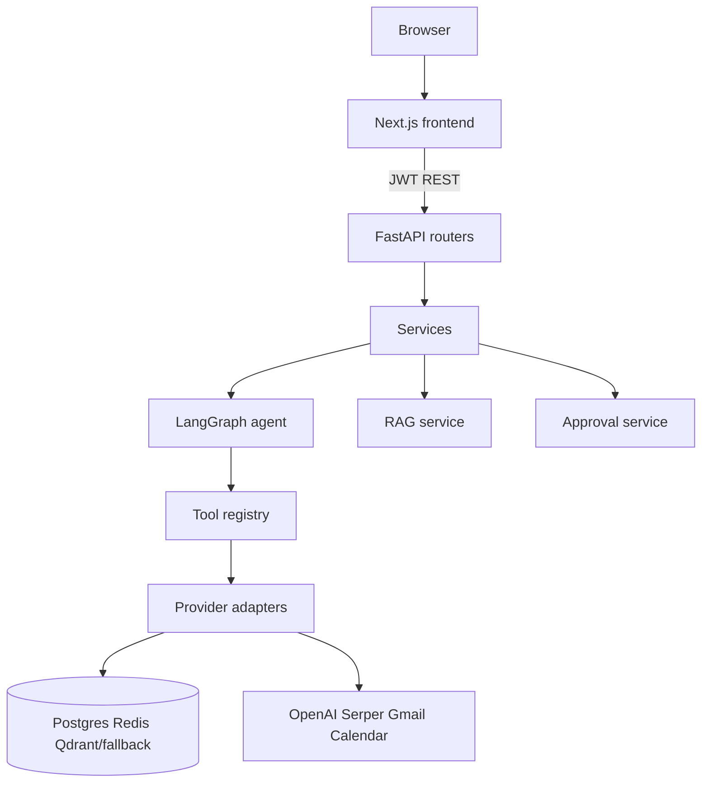

# OnePilot AI

**OnePilot AI** is a production-style AI operations workspace for small and medium businesses. It combines a company knowledge base (RAG with citations), a LangGraph agent for email/calendar/lead workflows, human approval gates, usage tracking, memory, and security guardrails in a multi-tenant SaaS architecture.

> **Live public demo:** [https://one-pilot-ai.vercel.app](https://one-pilot-ai.vercel.app) — click **Try the demo** (no account or credentials). Gmail and Calendar are **simulated** on the public track. Backend: [https://onepilot-ai-production.up.railway.app](https://onepilot-ai-production.up.railway.app).

> **Testing (verified 2026-07-20):** **703** backend tests passed (3 skipped); **126** frontend tests passed; lint, typecheck, and production build green. Public-demo smoke critical checks PASS against the live Railway backend. CI runs the same suites on every push/PR to `main` and `deployment/**`.

---

## Problem

Small businesses lose time across scattered docs, inbox drafts, scheduling, and leads. Generic chatbots are not enough — business AI needs grounded company knowledge, safe workflows, usage controls, auditability, and a human decision before anything external runs.

## Core AI capabilities

| Capability | What you get |
|------------|--------------|
| RAG knowledge base | Upload docs → chunk/embed → grounded answers with citations; weak-evidence guardrails |
| LangGraph agent | Two-stage intent routing, tool registry, multi-step workflows |
| Email & calendar tools | Draft emails, check availability, propose meetings — approval-gated before provider execution |
| Lead / ops insights | Seeded pipeline + dashboard usage/approvals overview |
| Memory | User/org memory CRUD; agent recall/persist on private tenants |
| HITL approvals | Owner/Admin approve or reject; full audit trail |
| Security | JWT + RBAC, tenant isolation, prompt-injection detection, rate limits, redaction |

Honest live-vs-mock matrix: [docs/capabilities.md](docs/capabilities.md)

---

## Architecture & stack



| Layer | Technology |
|-------|------------|
| Backend | Python 3.11+, FastAPI, Pydantic v2 |
| AI | LangGraph, LangChain, OpenAI (with deterministic fallbacks) |
| Data | PostgreSQL, SQLAlchemy 2.x, Alembic, Redis, Qdrant |
| Frontend | Next.js 16, TypeScript, Tailwind CSS, TanStack Query |
| Hosting (public demo) | Vercel (frontend) · Railway (API, Postgres, Redis) |

Deeper diagrams: [docs/architecture.md](docs/architecture.md)

---

## Human-in-the-loop safety

External actions never run autonomously. When the agent proposes a gated action:

1. An **ApprovalRequest** is created (payload + risk).
2. It appears in **Approvals** and as a workspace banner.
3. An **Owner/Admin** approves or rejects.
4. The decision is **audited**.

On the public demo, Gmail/Calendar providers are **mock**, send stays disabled, and shared-demo **agent memory is disabled** (memories cleared on demo start) so reviewers do not leak facts across sessions.

Details: [docs/safety_and_privacy.md](docs/safety_and_privacy.md) · [docs/security.md](docs/security.md)

---

## Public demo behavior

| Surface | Behavior |
|---------|----------|
| Entry | Landing → **Try the demo** → short-lived JWT (`POST /demo/start`) |
| Knowledge | Seeded NovaEdge corpus (19 docs) — real retrieval/answers |
| Workspace | Real agent chat + guided prompt chips + provider badges |
| Gmail / Calendar | **Simulated** mock providers; approval path still real |
| Leads / usage | Seeded leads + live usage/audit UI (Stripe billing is mock) |
| Memory | UI available; agent memory disabled on shared-demo tenant |
| Mobile | Bottom tabs + workspace Chat/History/Details panels |

Guided script: [docs/demo_script.md](docs/demo_script.md)  
Launch copy: [docs/portfolio/](docs/portfolio/)

---

## How to run locally

### Prerequisites

- Python 3.11+
- Node.js 20+ and [pnpm](https://pnpm.io/)
- Docker and Docker Compose
- Optional OpenAI / Serper keys (deterministic/mock fallbacks without them)

If your shell still exports a stale `VIRTUAL_ENV` pointing at an old Desktop checkout, see [docs/local_environment.md](docs/local_environment.md).

### Quick start

```bash
git clone https://github.com/Fejjii/OnePilot-AI.git onepilot-ai
cd onepilot-ai
cp .env.example .env

docker compose up -d postgres redis qdrant

cd backend
uv sync --extra dev   # or: pip install -e ".[dev]"
uv run alembic upgrade head
uv run uvicorn onepilot.api.main:app --reload --port 8000
```

```bash
cd frontend
cp .env.local.example .env.local   # NEXT_PUBLIC_API_URL=http://localhost:8000
pnpm install
pnpm dev
```

```bash
cd backend
uv run python scripts/seed_demo.py
```

- App: [http://localhost:3000](http://localhost:3000)
- One-click demo locally: set `PUBLIC_DEMO_ENABLED=true` in `backend/.env`, then use **Try the demo**
- API docs: [http://localhost:8000/docs](http://localhost:8000/docs)
- Health: [http://localhost:8000/health](http://localhost:8000/health)

### Full Docker stack

```bash
cp .env.example .env
docker compose build
docker compose up -d
docker compose run --rm migrate
docker compose run --rm seed
# or: make docker-build && make docker-up && make docker-migrate && make docker-seed
```

---

## Running tests

```bash
# Backend — 703 passed / 3 skipped (verified 2026-07-20)
cd backend
unset VIRTUAL_ENV   # if a stale Desktop path is exported
uv run python -m pytest -q

# Frontend — 126 passed; lint + typecheck + build (verified 2026-07-20)
cd frontend
pnpm lint && pnpm typecheck && pnpm test && pnpm build

# Makefile helpers
make test
make lint
```

Public-demo smoke (critical checks):

```bash
python scripts/smoke_test_public_demo.py \
  --base-url https://onepilot-ai-production.up.railway.app
```

---

## Page tour

| Page | Path | Description |
|------|------|-------------|
| Landing | `/` | Product, safety, architecture, **Try the demo** |
| Workspace | `/workspace` | Guided agent chat, citations, tool traces |
| Knowledge | `/knowledge` | Upload, search, grounded answers |
| Approvals | `/approvals` | HITL queue |
| Leads | `/leads` | Pipeline table |
| Memory | `/memory` | Durable facts (shared-demo agent memory disabled) |
| Usage | `/usage` | Quotas, mock billing preview, audit log |
| Evaluation | `/evaluation` | Offline quality metrics |
| Settings | `/settings` | Provider diagnostics (no secrets) |

Screenshot capture checklist: [docs/screenshots/](docs/screenshots/)

---

## Documentation

| Doc | Description |
|-----|-------------|
| [Architecture](docs/architecture.md) | Recruiter overview + Mermaid diagrams |
| [Capabilities matrix](docs/capabilities.md) | Live vs mocked features |
| [Safety & privacy](docs/safety_and_privacy.md) | HITL, isolation, demo memory rules |
| [Demo script](docs/demo_script.md) | Guided reviewer walkthrough |
| [Limitations & roadmap](docs/limitations_roadmap.md) | Honest gaps and next work |
| [Portfolio / launch kit](docs/portfolio/) | LinkedIn post, pitch, case study, interview points |
| [Local environment](docs/local_environment.md) | Venv/PATH repair notes |
| [Agent workflow](docs/agent_workflow.md) | Intents, tools, approvals |
| [RAG system](docs/rag_system.md) | Ingestion → citations |
| [Security](docs/security.md) | Auth, RBAC, guardrails |
| [Evaluation](docs/evaluation.md) | Offline eval harness |
| [Deployment](docs/deployment.md) | Docker / host runbooks |

---

## Known limitations

1. **Public demo Gmail/Calendar are mocked** — private live-Google track exists separately and is not the public demo.
2. **JWT in `localStorage`** — prefer HTTP-only cookies for production hardening.
3. **No streaming chat** yet (synchronous responses).
4. **HubSpot / Stripe / Twilio** are mock adapters in this version.
5. **Not full production SaaS** — documented gaps (no K8s manifests, no refresh-token SSO).

Full list + roadmap: [docs/limitations_roadmap.md](docs/limitations_roadmap.md)

---

## Contact

**Sofien Fejji**  
- GitHub: [Fejjii](https://github.com/Fejjii)  
- Email: sofien.fejji93@hotmail.com

## License

See repository license terms.
