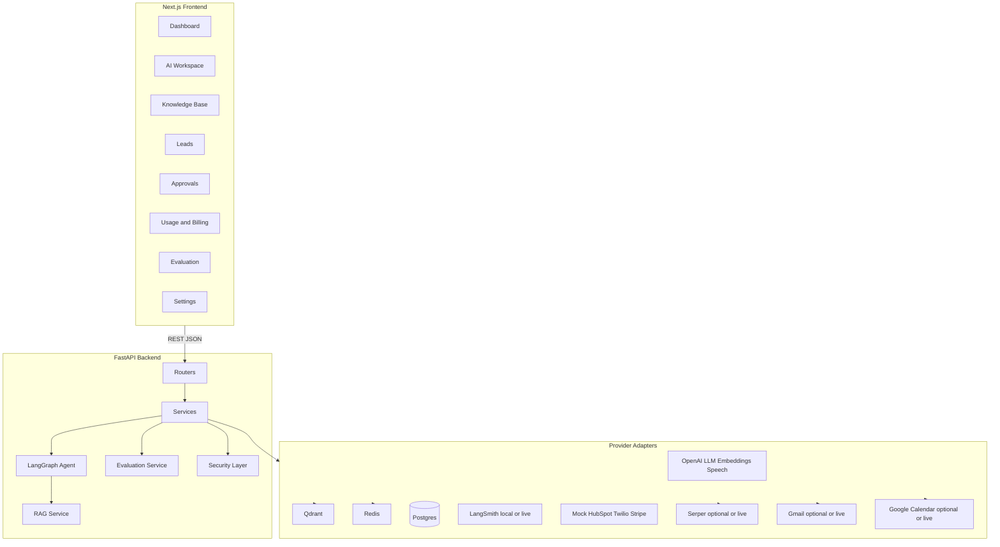

# OnePilot AI

**OnePilot AI** is a production-style AI-powered business workspace for small and medium businesses. It combines a company knowledge base, retrieval-augmented generation (RAG), agentic workflow automation, email drafting, lead management, human approval gates, usage tracking, memory, and security guardrails in a single multi-tenant SaaS platform.

> **Capstone project status:** All 8 phases complete. **641** backend tests passing. CI workflow validates backend, frontend, and evaluation suite. Full Docker stack validated locally.

**Public demo capable — not full production SaaS.** Suitable for a LinkedIn demo deployment (Vercel + Railway/Render) with managed Postgres, Qdrant, and Redis. Gmail, Calendar, HubSpot, and Stripe run in **mock mode** by default. Redis-backed rate limiting is implemented with in-memory fallback. Qdrant is **strongly recommended** for durable RAG. See [docs/deployment_checklist.md](docs/deployment_checklist.md).

---

## Problem Solved

Small businesses use many disconnected AI tools and lose time managing scattered knowledge, customer messages, leads, approvals, and operations. Generic chatbots are not enough — business AI needs company knowledge, safe workflows, usage controls, auditability, and human approval before acting.

**OnePilot AI** centralizes:
- Business knowledge (RAG over uploaded documents)
- AI agents with intent routing and tool calling (LangGraph)
- Human approval gates before any external action
- Usage tracking, audit logs, and memory per conversation
- Multi-tenant isolation so each organization's data stays private

---

## How It Works

1. **Upload knowledge** — markdown, text, CSV, PDF, or DOCX files are chunked and embedded into a vector store (Qdrant or in-memory fallback).
2. **Ask questions** — the AI retrieves the most relevant chunks, generates a grounded answer with citations, and refuses to answer when evidence is weak.
3. **Run workflows** — the LangGraph agent classifies the user's intent, selects tools, and creates approval requests for any external action (email send, CRM update, lead change).
4. **Approve or reject** — humans review pending actions in the Approvals queue before anything is executed.
5. **Track everything** — every action writes an audit log and usage event scoped to the organization.

---

## Key Features

| Feature | Notes |
|---------|-------|
| Multi-tenant SaaS | Organizations, users, roles (Owner/Admin/Member/Viewer), plans, quotas |
| RAG knowledge base | Upload, chunk, embed, search, grounded answers, citations, weak-evidence guardrail |
| LangGraph agent | Intent routing, tool registry, multi-step reasoning |
| Email drafting | LLM drafts in-app; Gmail draft/send after human approval when OAuth configured |
| Lead management | Lead tracking, qualification, CRM mock |
| Human approval gates | All external actions require explicit approval |
| Memory | Session, conversation, and long-term memory per org |
| Audit logs | Every sensitive action is logged with actor, org, and metadata |
| Usage tracking | Per-org quota enforcement and usage event history |
| Security | JWT auth, RBAC, prompt injection detection, sensitive data redaction, Redis-backed rate limiting |
| Provider adapters | Every external dependency has mock, fallback, or live modes; diagnostics in Settings |
| External web search | Serper-backed `external.web_search` tool; separated from internal RAG citations |

---

## External web search (Serper)

Set `SERPER_API_KEY` in `backend/.env` (see `.env.example`). Optional tuning: `SERPER_BASE_URL`, `SERPER_TIMEOUT_SECONDS`, `SERPER_MAX_RESULTS`.

- **Internal KB evidence** comes from `rag.answer` — citations show document titles from your uploaded knowledge base.
- **External web evidence** comes from `external.web_search` — citations show page titles and URLs from the public web.
- Combined questions (e.g. market trends vs NovaEdge services) route to `web_and_knowledge` and label **Internal company knowledge**, **External web evidence**, and **Recommendation** in the answer.
- Without a Serper key, the app keeps running in optional/mock mode and states that external search is not configured.

**Demo prompt:** `Find recent SMB automation trends and compare them with NovaEdge Solutions services.`

---

## Human-in-the-Loop (HITL)

External actions never run autonomously. When the agent proposes `send_email`, `update_crm`, `schedule_meeting`, or other gated actions:

1. An **ApprovalRequest** is created with the proposed payload and risk level.
2. The user sees a pending banner in AI Workspace and in the **Approvals** queue.
3. An Owner/Admin **approves** or **rejects** — rejected actions are not retried automatically.
4. Every decision is written to the **audit log**.

Email **drafting** does not require approval; **sending** does. See [docs/agent_workflow.md](docs/agent_workflow.md).

---

## Usage and Billing

- **Usage events** record tokens, latency, provider, feature, and estimated cost per org.
- **Quotas** enforce plan limits (chat, RAG, uploads, etc.) with progress shown on Dashboard and Usage pages.
- **Billing preview** uses mock Stripe adapters — estimated invoice lines, no real charges.
- Settings and `/providers` show honest live vs mock provider status.

See [docs/usage_billing.md](docs/usage_billing.md).

---

## Security and Guardrails

- JWT authentication with RBAC (Owner, Admin, Member, Viewer)
- Multi-tenant isolation on every query (`organization_id`)
- Prompt injection detection and sensitive-data redaction
- Rate limiting (Redis fixed-window when `REDIS_URL` is set; in-memory fallback per process)
- No API keys in the frontend; model names only via `/runtime/config`
- Audit trail for sensitive actions

See [docs/security.md](docs/security.md).

---

## Tech Stack

| Layer | Technology |
|-------|-----------|
| Backend | Python 3.11+, FastAPI, Pydantic v2 |
| AI / Agent | LangGraph, LangChain, OpenAI |
| Database | PostgreSQL, SQLAlchemy 2.x, Alembic |
| Cache | Redis |
| Vector DB | Qdrant |
| Frontend | Next.js 16, TypeScript, Tailwind CSS, TanStack Query |
| Testing | pytest (**599** tests), Ruff, Vitest |
| Infra | Docker Compose |

---

## Architecture Overview

```
┌──────────────────────────────────────────────────────┐
│                   Next.js Frontend                   │
│   Dashboard · AI Workspace · Knowledge · Leads       │
│   Approvals · Usage · Memory · Settings              │
└──────────────────────┬───────────────────────────────┘
                       │ REST API
┌──────────────────────▼───────────────────────────────┐
│                 FastAPI Backend                       │
│  ┌─────────┐ ┌──────────┐ ┌────────────────────┐    │
│  │ Routers │→│ Services │→│ Repos / Providers  │    │
│  │ (thin)  │ │ (logic)  │ │ (SQLAlchemy/Qdrant) │   │
│  └─────────┘ └──────────┘ └────────────────────┘    │
│  ┌──────────────────┐  ┌──────────────────────┐      │
│  │  LangGraph Agent │  │   Security Layer     │      │
│  │  intent · tools  │  │  RBAC · guardrails   │      │
│  └──────────────────┘  └──────────────────────┘      │
└──────┬──────────┬──────────┬────────────────────────┘
       │          │          │
  ┌────▼───┐ ┌───▼────┐ ┌───▼────┐
  │Postgres│ │ Redis  │ │ Qdrant │
  │  (DB)  │ │(cache) │ │(vector)│
  └────────┘ └────────┘ └────────┘
```

See [docs/architecture.md](docs/architecture.md) for full Mermaid diagrams.

### High-level architecture



---

## Quick Start (Local Dev)

### Prerequisites

- Python 3.11+
- Node.js 20+ and [pnpm](https://pnpm.io/)
- Docker and Docker Compose
- (Optional) OpenAI API key — without one, the system uses deterministic fallback providers

### 1. Clone and configure

```bash
git clone https://github.com/Fejjii/OnePilot-AI.git onepilot-ai
cd onepilot-ai
cp .env.example .env
# Edit .env — set OPENAI_API_KEY if you want real LLM responses (optional)
```

### 2. Start infrastructure

```bash
docker compose up -d postgres redis qdrant
```

### 3. Backend setup

```bash
cd backend
pip install -e ".[dev]"
alembic upgrade head
uvicorn onepilot.api.main:app --reload --port 8000
```

Or use the helper script:

```bash
cd backend
python scripts/dev_setup.py
```

### 4. Frontend setup

```bash
cd frontend
cp .env.local.example .env.local    # NEXT_PUBLIC_API_URL=http://localhost:8000
pnpm install
pnpm dev
```

### 5. Seed demo data

```bash
# Backend must be running
cd backend
python scripts/seed_demo.py
```

This creates the demo user **`admin@onepilot.ai` / `Demo1234!`**, ingests **19 NovaEdge** knowledge documents, and seeds **12 leads**, **8 approvals** (with pending items), **40 usage events**, and **25 audit log** entries when the org is empty.

### 6. Open the app

- Frontend: [http://localhost:3000](http://localhost:3000)
- **One-click demo:** set `PUBLIC_DEMO_ENABLED=true` in `backend/.env`, then use the **Try the demo** button on the login page — no credentials needed. The demo org is seeded automatically and Gmail/Calendar stay simulated.
- **Demo login (manual):** `admin@onepilot.ai` / `Demo1234!`
- Backend API docs: [http://localhost:8000/docs](http://localhost:8000/docs)
- Health check: [http://localhost:8000/health](http://localhost:8000/health)
- Provider diagnostics: [http://localhost:8000/providers](http://localhost:8000/providers)
- Safe model config: [http://localhost:8000/runtime/config](http://localhost:8000/runtime/config)

---

## Docker (Full Stack)

Run the entire stack — Postgres, Redis, Qdrant, backend, and frontend — in Docker:

```bash
# First-time: copy and configure .env
cp .env.example .env

# Build images
docker compose build

# Start full stack
docker compose up -d

# Run migrations
docker compose run --rm migrate

# Seed demo data
docker compose run --rm seed
```

Or use the Makefile:

```bash
make docker-build
make docker-up
make docker-migrate
make docker-seed
```

### Verify the stack

```bash
# Check all services are healthy
cd backend && python scripts/check_stack.py

# Or individually:
curl http://localhost:8000/health       # backend
curl http://localhost:6333/healthz      # qdrant
```

---

## Environment Variables

Copy `.env.example` to `.env` (root) and `frontend/.env.local.example` to `frontend/.env.local`.

| Variable | Required | Default | Description |
|----------|----------|---------|-------------|
| `APP_ENV` | No | `dev` | `dev` or `production` |
| `DATABASE_URL` | **Yes** | — | PostgreSQL connection string |
| `REDIS_URL` | No (strongly recommended) | — | Redis for shared rate-limit counters; in-memory fallback if unset |
| `QDRANT_URL` | No | — | Qdrant base URL (optional, in-memory fallback) |
| `QDRANT_API_KEY` | No | — | Qdrant API key for cloud |
| `OPENAI_API_KEY` | No | — | OpenAI key (optional, deterministic fallback without it) |
| `OPENAI_MODEL` | No | `gpt-4o-mini` | Chat completion model |
| `OPENAI_EMBEDDING_MODEL` | No | `text-embedding-3-small` | Embedding model |
| `OPENAI_SPEECH_MODEL` | No | `whisper-1` | Speech transcription model |
| `LANGSMITH_API_KEY` | No | — | LangSmith tracing (optional) |
| `LANGSMITH_TRACING` | No | `false` | Enable LangSmith trace export |
| `SERPER_API_KEY` | No | — | Serper web search (optional; mock results without it) |
| `SERPER_BASE_URL` | No | `https://google.serper.dev/search` | Serper search endpoint |
| `SERPER_TIMEOUT_SECONDS` | No | `10` | HTTP timeout for Serper |
| `SERPER_MAX_RESULTS` | No | `5` | Default max web results per query |
| `GOOGLE_CLIENT_ID` | No | — | Google OAuth client ID (Gmail + Calendar) |
| `GOOGLE_CLIENT_SECRET` | No | — | Google OAuth client secret (server env only) |
| `GOOGLE_REFRESH_TOKEN` | No | — | Google OAuth refresh token (server env only) |
| `GMAIL_SEND_ENABLED` | No | `false` | Allow Gmail send after approval (off by default) |
| `GOOGLE_CALENDAR_CREATE_ENABLED` | No | `true` | Allow Calendar event creation after approval |
| `JWT_SECRET` | **Yes** | `change-me-...` | Secret for signing JWTs — **change in production** (≥32 chars) |
| `JWT_EXPIRE_MINUTES` | No | `60` | JWT expiry in minutes |
| `CORS_ORIGINS` | **Yes** (production) | — | Comma-separated frontend URLs (e.g. Vercel deployment) |
| `DEV_AUTH_ENABLED` | No | `false` | Bypass JWT when no header — set `true` in local `.env` only; **must be false in production** |
| `DEV_BYPASS_QUOTAS` | No | `false` | Skip quota checks in dev |
| `NEXT_PUBLIC_API_URL` | **Yes** (frontend) | `http://localhost:8000` | Backend URL (baked into frontend build) |

### Mock vs live providers

| Provider | With credentials | Without credentials |
|----------|------------------|---------------------|
| OpenAI LLM / embeddings / speech | **Live** | **Missing** → deterministic fallback |
| Qdrant | **Live** | **Missing** → in-memory vectors |
| Redis | **Live** — shared rate limits | **Missing** → in-memory rate limits per process |
| Postgres | **Required** | — |
| LangSmith | **Live** tracing | **Missing** or **Local** trace steps |
| Serper Web Search | **Live** with `SERPER_API_KEY` | **Optional** — mock canned results; app stays up without key |
| Gmail | **Live** when `GOOGLE_*` OAuth env is set; **mock** otherwise | Draft after approval; send optional (`GMAIL_SEND_ENABLED`) |
| Google Calendar | **Live** when `GOOGLE_*` OAuth includes Calendar scopes; **mock** otherwise | Availability/slots without approval; event creation after approval |
| HubSpot, Twilio, Stripe | **Mock** in this version | Safe demo adapters |

Provider keys are set via environment variables only. **No API keys are stored in the frontend.** See Settings → Provider Diagnostics in the app.

---

## Running Tests

### Backend (641 tests)

```bash
cd backend
uv run python -m pytest          # all tests
uv run python -m pytest -v tests/test_chat.py   # single file
uv run python -m pytest -v --cov=onepilot       # with coverage
```

### Linting

```bash
cd backend
ruff check src tests
ruff format --check src tests
```

### Frontend

```bash
cd frontend
pnpm typecheck    # TypeScript check
pnpm lint         # ESLint
pnpm test         # Vitest
pnpm build        # production build
```

### All at once (Makefile)

```bash
make test     # backend + frontend tests
make lint     # backend + frontend linters
```

### CI

GitHub Actions (`.github/workflows/ci.yml`) runs on push/PR to `main`/`master`:

- Backend: install, full pytest, security tests, evaluation suite
- Frontend: install, typecheck, Vitest, production build

Optional Docker smoke test job is documented as a future CI step in the workflow file.

### Pre-deploy smoke test

```bash
python scripts/smoke_test_public_demo.py \
  --base-url http://localhost:8000 \
  --demo-email admin@onepilot.ai \
  --demo-password Demo1234!
```

Full checklist: [docs/deployment_checklist.md](docs/deployment_checklist.md)

---

## Evaluation

Deterministic offline evaluation (routing, RAG golden set, safety/HITL) with reports and a UI page:

```bash
cd backend
uv run python -m onepilot.evaluation.run_all_evals
```

Then open **Evaluation** in the app or `GET /evaluation/summary`. See [docs/evaluation.md](docs/evaluation.md) for metrics, datasets, limitations, and the RAGAS/LangSmith roadmap.

---

## Page Tour

| Page | Path | Description |
|------|------|-------------|
| Login / Register | `/login`, `/register` | Auth with JWT, dev bypass available |
| Dashboard | `/` | Usage summary, recent activity, quick actions |
| AI Workspace | `/workspace` | Chat with the LangGraph agent, citations, speech-to-text, email drafting |
| Knowledge Base | `/knowledge` | Upload documents, semantic search, grounded answers |
| Leads | `/leads` | Lead table with qualification status (12 seeded) |
| Email Assistant | `/workspace` | Email drafting via AI Workspace (`email_drafting` intent) |
| Approvals | `/approvals` | Review and approve/reject pending agent actions |
| Memory | `/memory` | Conversation memory and long-term facts |
| Usage & Admin | `/usage` | Usage events, quota status, billing preview, audit logs |
| Evaluation | `/evaluation` | Quality metrics, RAG/routing/safety tables, HITL policy |
| Settings | `/settings` | Model config, provider diagnostics, organization settings |

> **Screenshots:** Add captures under [docs/screenshots/](docs/screenshots/) — see placeholder README there.

### Manual testing

Full pre-push checklist: [docs/manual_test_checklist.md](docs/manual_test_checklist.md)

---

## Documentation

| Doc | Description |
|-----|-------------|
| [Architecture](docs/architecture.md) | System design, layer responsibilities, Mermaid diagrams |
| [Agent Workflow](docs/agent_workflow.md) | LangGraph flow, intents, tools, approval gates |
| [RAG System](docs/rag_system.md) | Ingestion, chunking, embeddings, retrieval, citations |
| [Security](docs/security.md) | Auth, RBAC, tenant isolation, guardrails, production gaps |
| [Evaluation](docs/evaluation.md) | Intent eval harness, test coverage, RAG evaluation approach |
| [Demo Script](docs/demo_script.md) | 8–10 minute reviewer demo walkthrough (12 steps) |
| [Manual Test Checklist](docs/manual_test_checklist.md) | Pre-push validation checklist |
| [Limitations & Roadmap](docs/limitations_roadmap.md) | Honest assessment of mock components and future work |
| [Data Model](docs/data_model.md) | Database schema and entity relationships |
| [Deployment](docs/deployment.md) | Docker and local run guide |
| [Deployment Checklist](docs/deployment_checklist.md) | Pre-deploy checklist for public LinkedIn demo |
| [Usage & Billing](docs/usage_billing.md) | Usage events and mock billing |
| [Google Workspace OAuth](docs/google_workspace_oauth_setup.md) | Gmail + Calendar OAuth refresh token setup |
| [Gmail OAuth](docs/gmail_oauth_setup.md) | Legacy Gmail-only OAuth helper (Calendar scopes not included) |

---

## Implementation Status

| Phase | Description | Status |
|-------|-------------|--------|
| 1 | Foundations & scaffold | ✅ Complete |
| 2 | Auth, tenants, plans, quotas | ✅ Complete |
| 3 | Demo data (NovaEdge Solutions) | ✅ Complete |
| 4 | RAG & knowledge base | ✅ Complete |
| 5 | LangGraph agent & tools | ✅ Complete |
| 6 | Approvals, usage tracking, memory | ✅ Complete |
| 7 | Frontend pages & integration | ✅ Complete |
| 8 | Docker, docs, finalization | ✅ Complete |

**641 backend tests passing.** Frontend: typecheck, lint, build, and Vitest pass.

---

## Multilingual Support

OnePilot supports multilingual **user interaction** in the AI Workspace and speech-to-text flow while keeping the knowledge base in its original language for grounded RAG.

### Supported languages

| Language | Code |
|----------|------|
| English | `en` |
| German | `de` |
| French | `fr` |
| Spanish | `es` |

### Language preference

- **Auto (default):** Detect language from the user message (or speech transcript) and reply in that language.
- **Fixed (`en` / `de` / `fr` / `es`):** Always reply in the selected language, even if the user writes in another language.

The workspace language selector controls response language only. Navigation and sidebar labels remain in English.

### RAG behavior

- Retrieval uses the **original user query** (source language).
- Optional **English query expansion** may run for non-English questions when OpenAI is configured, to improve recall against English KB documents.
- Answers are generated in the **response language**.
- **Citations keep original document titles and sections** (not translated).

### Speech-to-text

Transcription returns a detected `language` code. When preference is Auto, that hint is passed to the agent for more reliable detection.

### Current limitations

- Knowledge base documents are **not translated** at ingest time.
- UI chrome (nav, settings labels) is **English only**.
- Cross-lingual retrieval is heuristic (original query + optional English expansion), not full multilingual embeddings.

### Future work

- Translated knowledge base ingestion
- Multilingual document ingestion pipelines
- Stronger cross-lingual retrieval (multilingual embeddings, query routing)

---

## Known Limitations

1. **Provider modes** — Gmail and Google Calendar are **live** when Google OAuth env vars include the required scopes (approval-gated draft/send and calendar event creation). See [docs/google_workspace_oauth_setup.md](docs/google_workspace_oauth_setup.md). HubSpot, Stripe, and Twilio use in-memory mocks. Serper is **live when `SERPER_API_KEY` is set**; otherwise mock/optional mode.
2. **JWT in localStorage** — Tokens are stored in `localStorage` for simplicity. In production, use HTTP-only cookies.
3. **No streaming** — Chat responses are synchronous (no Server-Sent Events or WebSocket yet).
4. **Rate limiting** — Redis-backed when `REDIS_URL` is reachable (shared across workers). Without Redis, limits are in-memory per process and reset on restart.
5. **No OAuth/SSO** — Username/password only.
6. **Not full production SaaS** — Public demo deployment is supported (Vercel + Railway/Render) with documented gaps; no Kubernetes manifests, no HTTP-only cookies, no refresh tokens.
7. **Email Assistant** — No standalone page; email drafting runs inside AI Workspace.
8. **Editable model selection** — Models are environment-driven; UI selection is planned for a future version.

See [docs/limitations_roadmap.md](docs/limitations_roadmap.md) for the full list.

---

## Contact

**Sofien Fejji**  
- GitHub: [Fejjii](https://github.com/Fejjii)
- Email: sofien.fejji93@hotmail.com

---

## License

This project is part of an AI Engineering bootcamp capstone.
