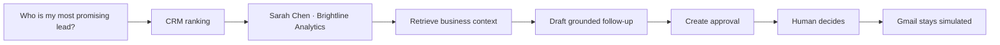
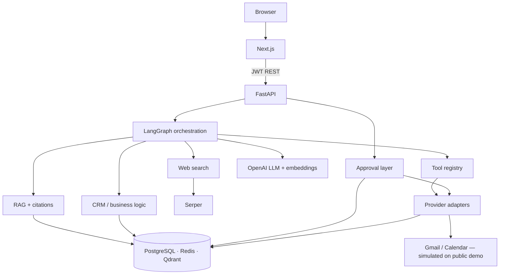

# OnePilot AI

**An Agentic AI operations workspace for small businesses** — grounded company knowledge, CRM-aware drafting, and human approval before any external action.

Production-style multi-tenant SaaS: RAG, tool calling, HITL, evaluation, observability, and cost controls. Not a chatbot wrapper.

**[Live demo →](https://one-pilot-ai.vercel.app)** · no account required · click **Try the demo**  
Backend: [onepilot-ai-production.up.railway.app](https://onepilot-ai-production.up.railway.app)

`Python` · `FastAPI` · `LangGraph` · `OpenAI` · `Qdrant` · `PostgreSQL` · `Redis` · `Next.js` · `Vercel` · `Railway`

> **Public demo:** Gmail and Calendar actions are **simulated**. Real LLM inference, RAG, web search, CRM logic, citations, execution traces, and approvals are live.

---

## Why I built it

Small businesses lose time across scattered docs, inboxes, calendars, and leads. Generic chatbots answer questions; they do not run a **safe operations loop**.

OnePilot is the control plane for that problem:

**Ask → retrieve company knowledge → inspect CRM context → optionally search the web → draft the next action → stop for a human → execute only through an approved provider path → show the trace.**

---

## What it demonstrates

| Concept | How it shows up |
|---------|-----------------|
| **Generative AI** | Live OpenAI chat on the public demo (`gpt-5-nano` runtime) |
| **Agentic AI** | LangGraph two-stage routing → tool selection → multi-step workflows |
| **RAG / vector search** | Tenant-scoped Qdrant retrieval with citations and a weak-evidence path |
| **Tool calling** | Central registry for RAG, CRM, email, calendar, and Serper web search |
| **Structured outputs** | Intent schemas, email drafts, workspace insights, typed API responses |
| **Human-in-the-loop** | External side effects create an `ApprovalRequest` before provider execution |
| **Evaluation** | Offline routing / RAG / safety harness + an Evaluation page |
| **Guardrails** | Prompt-injection checks, RBAC, redaction, rate limits, spend caps |
| **Multi-tenancy** | `organization_id` isolation in Postgres, repositories, and vector collections |
| **Observability** | Recruiter-facing execution traces, audit log, usage events, request IDs |
| **Cost-aware architecture** | Quotas, token accounting, public-demo budgets, mock/live provider fallbacks |
| **Cloud deployment** | Next.js on Vercel + FastAPI / Postgres / Redis on Railway |

Honest live-vs-simulated matrix: [docs/capabilities.md](docs/capabilities.md)

---

## Live recruiter journey

Seeded demo tenant: **NovaEdge Solutions**. Highest-ranked open lead: **Sarah Chen**, VP Operations at **Brightline Analytics** (`qualified`, `high` urgency).


```mermaid
flowchart LR
    Ask["Who is my most promising lead?"] --> Rank["CRM ranking"]
    Rank --> Sarah["Sarah Chen · Brightline Analytics"]
    Sarah --> Context["Retrieve business context"]
    Context --> Draft["Draft grounded follow-up"]
    Draft --> Approve["Create approval"]
    Approve --> Human["Human decides"]
    Human --> Mock["Gmail stays simulated"]
```

| Step | What happens | What is real |
|------|----------------|--------------|
| 1. Ask | `Who is my most promising lead?` | Live agent + CRM ranking (`rank_leads`) |
| 2. Identify | Sarah Chen / Brightline Analytics | Seeded CRM, not a hardcoded UI string |
| 3. Ground | Pain point, next action, company context | Org-scoped lead facts; no invented customer data |
| 4. Draft | `Draft a follow-up email to my most promising lead.` | Live LLM draft to `sarah.chen@brightline.io` |
| 5. Gate | Approval card in **Approvals** | Real HITL workflow + audit trail |
| 6. Decide | Owner/Admin approves or rejects | Decision is persisted |
| 7. Execute | Provider path after approval | **Gmail remains mock** on the public demo |

The same loop covers calendar: availability and open slots are readable; creating a meeting still stops at approval. No anonymous Gmail messages or Google Calendar writes.

---

## Architecture


```mermaid
flowchart TB
    Browser["Browser"] --> FE["Next.js"]
    FE -->|"JWT REST"| API["FastAPI"]
    API --> Agent["LangGraph orchestration"]
    API --> HITL["Approval layer"]

    Agent --> RAG["RAG + citations"]
    Agent --> CRM["CRM / business logic"]
    Agent --> Web["Web search"]
    Agent --> Tools["Tool registry"]

    RAG --> Data[("PostgreSQL · Redis · Qdrant")]
    CRM --> Data
    HITL --> Data

    Agent --> OpenAI["OpenAI LLM + embeddings"]
    Web --> Serper["Serper"]
    Tools --> Adapters["Provider adapters"]
    HITL --> Adapters
    Adapters --> Mock["Gmail / Calendar — simulated on public demo"]
    Adapters --> Data
```

| Layer | Role |
|-------|------|
| Frontend | Landing, guided workspace, knowledge, leads, approvals, evaluation |
| API | Thin FastAPI routers, JWT principal, validation |
| Agent | Two-stage message/intent routing, tools, structured response |
| Data | Tenant-scoped Postgres, Redis rate limits, Qdrant vectors |
| Providers | OpenAI / Serper live on public demo; Gmail / Calendar mock adapters |
| Approvals | Human gate before any external side effect |

Deeper diagrams: [docs/architecture.md](docs/architecture.md)

---

## AI system design

| Concern | Design |
|---------|--------|
| **Routing** | Stage 1 classifies the message; stage 2 selects an intent and tools. Meta, correction, and out-of-scope requests are separated before tool use. |
| **RAG** | Ingest → section-aware chunk → embed → tenant-filtered retrieve → answer with citations. Weak evidence returns a safe hedge and **does not call the LLM**. |
| **Tool use** | The graph never calls providers directly. Tools go through a registry; services own business rules. |
| **Structured responses** | Intent classification, email drafts, and workspace insights are schema-shaped, not free-text scrapes. |
| **Grounding** | Email drafts resolve org-scoped CRM leads and must not invent customer facts or emit placeholder tokens. Internal KB citations stay separate from Serper URLs. |
| **Approvals** | Gated actions create a Postgres `ApprovalRequest`. Rejected work is not auto-retried. Gmail send stays disabled by default. |
| **Execution traces** | Assistant messages persist a sanitized trace (`Understanding request`, `Reading CRM context`, tool labels). Prompts, tokens, secrets, and raw provider payloads stay off the recruiter UI. |
| **Evaluation** | Deterministic offline suites for routing, RAG golden cases, and safety/HITL policy. Not a RAGAS production scorecard. |
| **Fallbacks / safety** | Prompt-injection block before the graph. Missing keys use deterministic LLM/embedding fallbacks. Public demo forces mock Gmail/Calendar and disables shared-tenant agent memory. |

Details: [docs/agent_workflow.md](docs/agent_workflow.md) · [docs/rag_system.md](docs/rag_system.md)

---

## Real vs simulated

Verified against the live public demo (`/health`, `/runtime/config`) and matching `main` / `deployment/public-demo` refs.

| Capability | Public demo |
|------------|-------------|
| OpenAI LLM inference (`gpt-5-nano`) | **Real** |
| OpenAI embeddings (`text-embedding-3-small`) | **Real** |
| Qdrant RAG / vector retrieval | **Real** |
| PostgreSQL + Redis | **Real** |
| Serper web search | **Real** |
| Agent routing, tool selection, CRM logic | **Real** |
| Citations + execution traces | **Real** |
| HITL approvals + evaluation surface | **Real** |
| FastAPI + Next.js on Railway / Vercel | **Real** |
| Gmail draft / send | **Simulated** (mock provider; send disabled) |
| Google Calendar writes | **Simulated** (mock provider; create disabled) |
| Public speech transcription | **Disabled** |
| Shared-demo agent memory persist | **Disabled** (cleared on `/demo/start`) |
| Stripe billing / HubSpot CRM | **Mock adapters** |

Local default chat model in repo config is `gpt-4o-mini`. The **deployed public runtime is `gpt-5-nano`**. Do not treat those as the same claim.

---

## Tech stack

Verified from `backend/pyproject.toml`, `frontend/package.json`, `docker-compose.yml`, and CI.

| Layer | Technology |
|-------|------------|
| **AI** | LangGraph, LangChain Core, OpenAI Chat + Embeddings, Serper |
| **Backend** | Python 3.11+, FastAPI, Pydantic v2, Uvicorn, SQLAlchemy 2.x, Alembic |
| **Data** | PostgreSQL 16, Redis 7, Qdrant |
| **Frontend** | Next.js 16, React 19, TypeScript, Tailwind CSS 4, TanStack Query, Zod |
| **Infrastructure** | Vercel, Railway, Docker Compose, GitHub Actions |
| **Quality** | pytest, Vitest, Ruff, ESLint, `tsc`, offline evaluation harness |

Latest green CI on `main` at the time of this polish: **800+** backend tests (821 passed, 3 skipped) and **170+** frontend tests (171 passed), plus typecheck and production build. Prefer the ranges; exact counts move with the suite.

---

## Safety and reliability

Implemented and interview-defensible — not a claim of enterprise SOC2 maturity.

- **Tenant isolation** — `organization_id` on models, repository filters, per-org Qdrant collections
- **RBAC** — Owner / Admin / Member / Viewer
- **HITL** — no autonomous Gmail, calendar-create, or CRM-style side effects
- **Provider safety** — mock / live / fallback adapters; public demo refuses live Google
- **Rate limiting** — Redis-backed on Railway; extra chat/web/IP caps on the shared demo
- **Redaction** — secrets stripped from logs and recruiter traces
- **Prompt-injection defenses** — pattern checks before the agent graph
- **Shared-demo isolation** — agent memory disabled; `/demo/start` clears memories and stale visitor approvals
- **Spend controls** — org quotas plus public-demo daily token and search budgets

Known trade-off: JWT is stored in `localStorage`. Production hardening should move to HTTP-only cookies and refresh tokens. See [docs/security.md](docs/security.md) and [docs/safety_and_privacy.md](docs/safety_and_privacy.md).

---

## Evaluation and quality

The **Evaluation** page reads an offline report. Suites cover:

- Two-stage routing / intent labels
- RAG golden cases (source hit, citations, weak-evidence behavior)
- Safety and HITL policy (injection, approval gating)

These are **demo-quality regression checks** on a small labeled set. They do not call live Qdrant in CI and are not a substitute for RAGAS, LangSmith datasets, or human eval. No production accuracy SLO is claimed here.

Harness: [docs/evaluation.md](docs/evaluation.md)

---

## Try it

Open **[https://one-pilot-ai.vercel.app](https://one-pilot-ai.vercel.app)** → **Try the demo**.

Suggested prompts (5–7 minutes):

1. `Give me a business summary.`
2. `Who is my most promising lead?`
3. `Draft a follow-up email to my most promising lead.`
4. `What does our escalation/refund policy say?`
5. `Show my meetings this week.`
6. `Find available time slots.`
7. `Search the web for recent SMB support-automation trends.`

Then open **Approvals**, **Leads**, **Knowledge**, and **Evaluation**. Guided script: [docs/demo_script.md](docs/demo_script.md)

---

## Run locally

### Prerequisites

- Python 3.11+
- Node.js 20+ and [pnpm](https://pnpm.io/)
- Docker and Docker Compose
- Optional OpenAI / Serper keys (deterministic/mock fallbacks without them)

If a stale `VIRTUAL_ENV` is exported from an old checkout, see [docs/local_environment.md](docs/local_environment.md).

### Quick start

```bash
git clone https://github.com/Fejjii/OnePilot-AI.git onepilot-ai
cd onepilot-ai
cp .env.example .env

docker compose up -d postgres redis qdrant

cd backend
uv sync --extra dev   # or: pip install -e ".[dev]"
uv run alembic upgrade head
uv run uvicorn onepilot.api.main:app --reload --port 8000
```

```bash
cd frontend
pnpm install
pnpm dev
```

The frontend defaults to `http://localhost:8000`. Override with `NEXT_PUBLIC_API_URL` in `frontend/.env.local` if needed.

```bash
cd backend
uv run python scripts/seed_demo.py
```

- App: [http://localhost:3000](http://localhost:3000)
- One-click demo locally: set `PUBLIC_DEMO_ENABLED=true` in backend env, then use **Try the demo**
- API docs: [http://localhost:8000/docs](http://localhost:8000/docs)
- Health: [http://localhost:8000/health](http://localhost:8000/health)

### Full Docker stack

```bash
cp .env.example .env
docker compose build
docker compose up -d
docker compose run --rm migrate
docker compose run --rm seed
```

### Tests

```bash
cd backend && uv run python -m pytest -q
cd frontend && pnpm lint && pnpm typecheck && pnpm test && pnpm build
make test
```

Public-demo smoke (never print tokens):

```bash
python scripts/smoke_test_public_demo.py \
  --base-url https://onepilot-ai-production.up.railway.app
```

---

## Project structure and documentation

```text
backend/     FastAPI, LangGraph agent, RAG, providers, eval
frontend/    Next.js 16 workspace
docs/        Architecture, capabilities, safety, deployment
scripts/     Public-demo smoke tests, Cloud handoff / reports
```

| Page | Path |
|------|------|
| Landing | `/` |
| Workspace | `/workspace` |
| Knowledge | `/knowledge` |
| Approvals | `/approvals` |
| Leads | `/leads` |
| Memory | `/memory` |
| Usage | `/usage` |
| Evaluation | `/evaluation` |
| Settings | `/settings` |

| Doc | Description |
|-----|-------------|
| [Architecture](docs/architecture.md) | System design and diagrams |
| [Capabilities](docs/capabilities.md) | Live vs mocked features |
| [Safety & privacy](docs/safety_and_privacy.md) | HITL, isolation, demo memory |
| [Agent workflow](docs/agent_workflow.md) | Intents, tools, approvals |
| [RAG system](docs/rag_system.md) | Ingestion → citations |
| [Evaluation](docs/evaluation.md) | Offline quality harness |
| [Security](docs/security.md) | Auth, RBAC, guardrails |
| [Deployment](docs/deployment.md) | Docker / host runbooks |
| [Limitations & roadmap](docs/limitations_roadmap.md) | Honest gaps |
| [Demo script](docs/demo_script.md) | Reviewer walkthrough |
| [Portfolio kit](docs/portfolio/) | Pitch, case study, interview points |

---

## Limitations

1. **Public-demo Gmail/Calendar are mocked.** A private live-Google track exists separately and is not this demo.
2. **JWT in `localStorage`** — prefer HTTP-only cookies for production hardening.
3. **No streaming chat** yet (synchronous responses).
4. **HubSpot / Stripe / Twilio** are mock adapters.
5. **Not full production SaaS** — no Kubernetes, no refresh-token SSO, no object storage.

Detailed debt: [docs/limitations_roadmap.md](docs/limitations_roadmap.md)

---

## About the engineering work

This repository is a full-stack AI product, not a notebook. The work spans:

- **Product architecture** — multi-tenant workspace, approval-gated side effects, one-click public demo
- **AI application design** — routing, RAG, tool use, grounding, traces, fallbacks
- **Backend / API** — FastAPI, services, repositories, provider adapters
- **Data / RAG infrastructure** — Postgres, Redis, Qdrant, chunking, embeddings, citations
- **Frontend integration** — guided workspace, citations, traces, mobile layout
- **Evaluation** — deterministic routing / RAG / safety suites surfaced in the UI
- **Deployment** — Vercel + Railway public track, Docker Compose local stack
- **Safety** — tenancy, RBAC, HITL, redaction, demo isolation, spend caps
- **CI / testing** — 800+ backend and 170+ frontend tests on every `main` PR

---

## Contact

**Sofien Fejji**  
- GitHub: [Fejjii](https://github.com/Fejjii)  
- Email: sofien.fejji93@hotmail.com

## License

See repository license terms.
