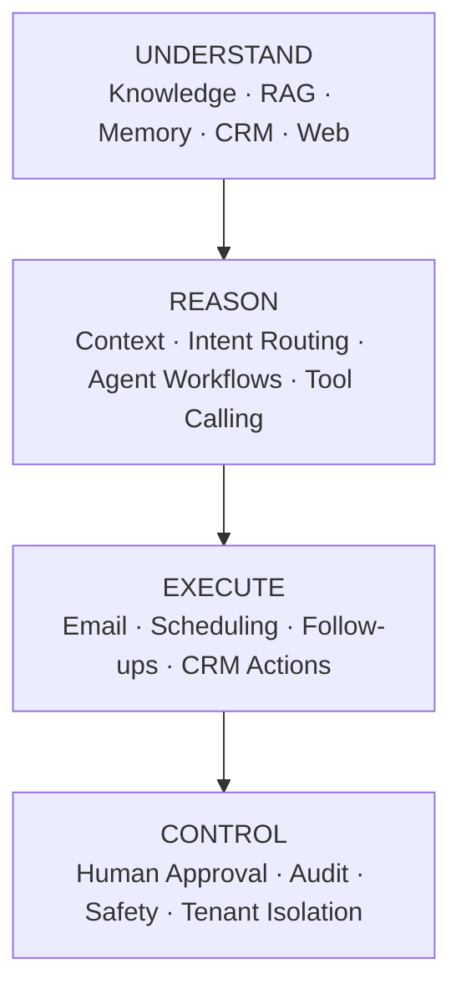
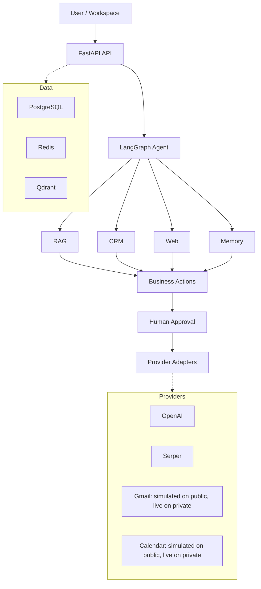
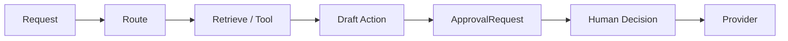

<div align="center">

# OnePilot AI

**“From scattered business tools to one intelligent operating layer.”**

A production-style Agentic AI operations platform combining company knowledge, CRM context, web research, tool-connected workflows, and human-controlled execution.

[Live Demo](https://one-pilot-ai.vercel.app) · [Architecture](docs/portfolio/ARCHITECTURE_OVERVIEW.md) · [Capabilities](docs/capabilities.md) · [Evaluation](docs/evaluation.md) · [Demo Script](docs/portfolio/RECRUITER_DEMO_SCRIPT.md)

`Python` · `FastAPI` · `LangGraph` · `OpenAI` · `Qdrant` · `PostgreSQL` · `Redis` · `Serper` · `Next.js` · `TypeScript` · `Vercel` · `Railway`

</div>

---

## What is OnePilot?

OnePilot is **not simply a chatbot**.

It is an operations layer that can retrieve company knowledge, reason over CRM
and business context, search the web, use tools, prepare email and calendar
actions, preserve memory in authenticated workspaces, and **stop for human
approval** before sensitive execution.


```mermaid
flowchart TB
    U["UNDERSTAND<br/>Knowledge · RAG · Memory · CRM · Web"]
    R["REASON<br/>Context · Intent Routing · Agent Workflows · Tool Calling"]
    E["EXECUTE<br/>Email · Scheduling · Follow-ups · CRM Actions"]
    C["CONTROL<br/>Human Approval · Audit · Safety · Tenant Isolation"]
    U --> R --> E --> C
```

The public demo uses a seeded sample company, **NovaEdge Solutions**. NovaEdge
is fictional. It is not OnePilot itself.

Implementation detail lives in the [deeper technical documentation](#deeper-technical-documentation).

---

## Why I built it

Business work is fragmented across documents, CRM records, email, calendar, and
external information.

Generic assistants generate answers. OnePilot explores a safer operational AI
loop: understand the request, retrieve the right context, draft the next
action, then wait for a human before anything sensitive is executed.

---

## Core capabilities

High-level product surface. Each area links to the technical reference.

| Capability | What you can see | Deeper doc |
|------------|------------------|------------|
| **Agentic orchestration** | Two-stage routing, tool calling, multi-step workflows | [Agent workflow](docs/agent_workflow.md) |
| **Company knowledge / RAG** | Tenant-scoped retrieval with citations | [RAG system](docs/rag_system.md) |
| **CRM & lead intelligence** | Ranked leads and grounded follow-up context | [Capabilities](docs/capabilities.md) |
| **Live web research** | Serper search with source-aware summaries | [Capabilities](docs/capabilities.md) |
| **Email workflows** | Grounded drafts; provider execution is approval-gated | [Agent workflow](docs/agent_workflow.md) |
| **Calendar workflows** | Availability vs meetings vs scheduling, distinctly routed | [Agent workflow](docs/agent_workflow.md) |
| **HITL approvals** | Sensitive actions create an `ApprovalRequest` first | [Safety](docs/safety_and_privacy.md) |
| **Memory & personalization** | Persistent in authenticated workspaces; disabled on the public shared demo | [Safety](docs/safety_and_privacy.md) |
| **Multilingual replies** | English / French / German / Spanish responses | [Architecture](docs/architecture.md) |
| **Voice input** | Available in authenticated / private mode; disabled on the public demo | [Capabilities](docs/capabilities.md) |
| **Multi-tenancy / RBAC** | Organization isolation and Owner / Admin / Member / Viewer roles | [Security](docs/security.md) |
| **Execution traces** | Recruiter-facing steps, not prompts or secrets | [Architecture](docs/architecture.md) |
| **Evaluation / regression** | Deterministic routing, RAG, and safety suites | [Evaluation](docs/evaluation.md) |

Honest live-vs-simulated matrix: [docs/capabilities.md](docs/capabilities.md)

---

## Two deployment tracks

This is a deliberate product and safety decision — not a missing feature.

### Public recruiter demo

**[https://one-pilot-ai.vercel.app](https://one-pilot-ai.vercel.app)** — no account required.

Live on this track:

- OpenAI LLM inference (`gpt-5-nano`)
- OpenAI embeddings
- Qdrant retrieval
- PostgreSQL
- Redis
- Serper
- Routing, CRM logic, RAG, citations
- Execution traces
- HITL approvals

Safe public restrictions:

- Gmail actions **simulated**
- Calendar writes **simulated**
- Persistent shared-demo agent memory **disabled**
- Public speech transcription **disabled**

### Private integration track

Authenticated and organization-restricted. Not a public CTA.

Validated on this track:

- Real Gmail **draft** creation
- Real Google Calendar **event** creation
- Voice input
- Persistent tenant-scoped memory

Safety that still holds:

- Gmail draft creation remains **approval-gated**
- Calendar writes remain **approval-gated**
- Gmail **sending remains disabled**

The public deployment proves real AI infrastructure without exposing anonymous
users to write-capable business integrations.

The private deployment validates the real provider path in a controlled
authenticated environment.

Operator setup (variable names only): [docs/private_demo/LIVE_GOOGLE_SETUP.md](docs/private_demo/LIVE_GOOGLE_SETUP.md)

---

## High-level architecture


```mermaid
flowchart TB
    User["User / Workspace"] --> API["FastAPI API"]
    API --> Agent["LangGraph Agent"]

    Agent --> RAG["RAG"]
    Agent --> CRM["CRM"]
    Agent --> Web["Web"]
    Agent --> Mem["Memory"]

    RAG --> Actions["Business Actions"]
    CRM --> Actions
    Web --> Actions
    Mem --> Actions

    Actions --> HITL["Human Approval"]
    HITL --> Adapters["Provider Adapters"]

    subgraph Data["Data"]
        PG["PostgreSQL"]
        RD["Redis"]
        QD["Qdrant"]
    end

    subgraph Providers["Providers"]
        OA["OpenAI"]
        SP["Serper"]
        GM["Gmail: simulated on public, live on private"]
        GC["Calendar: simulated on public, live on private"]
    end

    API -.-> Data
    Adapters -.-> Providers
```

**Deep technical architecture → [docs/architecture.md](docs/architecture.md)**

---

## RAG in one simple flow

**NovaEdge Solutions** is a fictional sample company used to demonstrate
retrieval. It is not OnePilot.

```text
Document → Chunk → Embed → Qdrant → Retrieve → Evidence Check → Generate → Cite
```

What that means in practice:

- **19** seeded NovaEdge sample-company documents
- Section-aware chunking
- OpenAI embeddings
- Tenant-scoped vector retrieval
- Citations on knowledge answers
- Weak-evidence handling: if retrieval is thin, the system hedges instead of guessing

Details: [docs/rag_system.md](docs/rag_system.md)

---

## Agent / HITL flow


```mermaid
flowchart LR
    Req["Request"] --> Route["Route"]
    Route --> Tools["Retrieve / Tool"]
    Tools --> Draft["Draft Action"]
    Draft --> AR["ApprovalRequest"]
    AR --> Human["Human Decision"]
    Human --> Provider["Provider"]
```

The AI may **prepare** an action. It does not autonomously bypass approval.

Gmail send stays disabled. Public Gmail and Calendar writes stay simulated.
Private Google writes still require a human decision.

Details: [docs/agent_workflow.md](docs/agent_workflow.md)

---

## Real vs simulated

Public behavior is the one reviewers will see.

| Capability | Public recruiter demo | Private authenticated track |
|------------|----------------------|-----------------------------|
| OpenAI LLM (`gpt-5-nano` on public) | **Live** | Live |
| OpenAI embeddings | **Live** | Live |
| Qdrant retrieval | **Live** | Live |
| PostgreSQL + Redis | **Live** | Live |
| Serper web search | **Live** | Live |
| Routing, CRM logic, RAG, citations | **Live** | Live |
| Execution traces + HITL approvals | **Live** | Live |
| Gmail draft / send | **Simulated** (send disabled) | Draft **live**, still approval-gated; **send disabled** |
| Google Calendar writes | **Simulated** | **Live**, still approval-gated |
| Speech transcription | **Disabled** | **Available** |
| Persistent agent memory | **Disabled** | **Tenant-scoped persist** |
| HubSpot / Salesforce / Stripe / Slack / Twilio | **Not live** | **Not live** |
| MCP | **Not implemented** | **Not implemented** |

Local default chat model in repo config is `gpt-4o-mini`. The **deployed public
runtime is `gpt-5-nano`**. Those are different claims.

---

## Quality / evaluation

Quality gates around this release:

- **900+** backend tests
- **180** frontend tests
- **53** release/script tests
- Type checking
- Production builds
- GitHub Actions CI
- Final public smoke testing

**79-case deterministic evaluation suite:**

| Metric | Result |
|--------|--------|
| Intent accuracy | 100% |
| Routing accuracy | 100% |
| RAG golden pass | 100% |
| Citation presence | 100% |
| Source hit rate | 90% |
| Weak-evidence correctness | 100% |
| Safety / HITL pass | 100% |
| Total cases | 79 |
| Failed cases | 0 |

These are deterministic demo-quality regression checks on a small labeled
dataset. They are not a claim that the AI system is universally 100% accurate.

They are not a production SLO. This harness is not RAGAS and is not a human
evaluation study.

Harness: [docs/evaluation.md](docs/evaluation.md)

---

## Tech stack

| Layer | Technology |
|-------|------------|
| **AI** | LangGraph, OpenAI, embeddings, Serper |
| **Backend** | Python, FastAPI, Pydantic, SQLAlchemy |
| **Data** | PostgreSQL, Redis, Qdrant |
| **Frontend** | Next.js, React, TypeScript, Tailwind |
| **Infrastructure** | Vercel, Railway, Docker, GitHub Actions |

---

## Try it

Open **[https://one-pilot-ai.vercel.app](https://one-pilot-ai.vercel.app)** → **Try the demo**.

Suggested sequence:

1. `What services does NovaEdge Solutions offer?` → RAG / citations
2. `Who is my most promising lead?` → CRM intelligence
3. `Draft a follow-up email to my most promising lead.` → grounded drafting + approval
4. `When am I available tomorrow between 9 AM and 5 PM?` → calendar routing
5. `Search the web for the latest OpenAI news and summarize the three most relevant developments with sources.` → Serper / source-aware web research

Then open **Knowledge**, **Leads**, **Approvals**, and **Evaluation**.

Guided scripts: [3-minute recruiter cut](docs/portfolio/RECRUITER_DEMO_SCRIPT.md) · [full walkthrough](docs/demo_script.md)

---

## Deeper technical documentation

The README is the product entry point. **Implementation detail lives in these
documents.**

| Doc | What it is |
|-----|------------|
| [Architecture overview](docs/portfolio/ARCHITECTURE_OVERVIEW.md) | 30–60 second technical scan |
| [Architecture](docs/architecture.md) | Deep system design |
| [Agent workflow](docs/agent_workflow.md) | Routing, tools, approvals |
| [RAG system](docs/rag_system.md) | Ingest → retrieve → cite |
| [Data architecture](docs/data_architecture.md) | Postgres, Redis, Qdrant, tenancy |
| [Capabilities](docs/capabilities.md) | Honest live vs simulated matrix |
| [Evaluation](docs/evaluation.md) | Offline regression harness |
| [Security](docs/security.md) | Auth, RBAC, guardrails |
| [Safety & privacy](docs/safety_and_privacy.md) | HITL, isolation, demo memory |
| [Limitations & roadmap](docs/limitations_roadmap.md) | Honest gaps |

---

## Local development

<details>
<summary>Prerequisites and quick start</summary>

**Prerequisites**

- Python 3.11+
- Node.js 20+ and [pnpm](https://pnpm.io/)
- Docker and Docker Compose
- Optional OpenAI / Serper keys (deterministic / mock fallbacks without them)

If a stale `VIRTUAL_ENV` is exported from an old checkout, see
[docs/local_environment.md](docs/local_environment.md).

**Quick start**

```bash
git clone https://github.com/Fejjii/OnePilot-AI.git onepilot-ai
cd onepilot-ai
cp .env.example .env

docker compose up -d postgres redis qdrant

cd backend
uv sync --extra dev   # or: pip install -e ".[dev]"
uv run alembic upgrade head
uv run uvicorn onepilot.api.main:app --reload --port 8000
```

```bash
cd frontend
pnpm install
pnpm dev
```

The frontend defaults to `http://localhost:8000`. Override with
`NEXT_PUBLIC_API_URL` in `frontend/.env.local` if needed.

```bash
cd backend
uv run python scripts/seed_demo.py
```

- App: [http://localhost:3000](http://localhost:3000)
- One-click demo locally: set `PUBLIC_DEMO_ENABLED=true` in backend env, then use **Try the demo**
- API docs: [http://localhost:8000/docs](http://localhost:8000/docs)
- Health: [http://localhost:8000/health](http://localhost:8000/health)

</details>

<details>
<summary>Full Docker stack and tests</summary>

```bash
cp .env.example .env
docker compose build
docker compose up -d
docker compose run --rm migrate
docker compose run --rm seed
```

```bash
cd backend && uv run python -m pytest -q
cd frontend && pnpm lint && pnpm typecheck && pnpm test && pnpm build
make test
```

Public-demo smoke (never print tokens):

```bash
python scripts/smoke_test_public_demo.py \
  --base-url https://onepilot-ai-production.up.railway.app
```

</details>

---

## Limitations

Honest, current constraints:

- JWT currently in `localStorage`
- Synchronous chat — no streaming
- No distributed background worker
- No original-file object storage
- Public Google actions simulated
- Public persistent agent memory disabled
- Small deterministic evaluation datasets
- No enterprise SSO / Kubernetes
- Mock / integration-ready providers are not live (HubSpot, Salesforce, Stripe, Slack, Twilio)

This is implemented product safety and architecture — not a SOC2 or enterprise
certification claim.

Detailed debt: [docs/limitations_roadmap.md](docs/limitations_roadmap.md)

---

## Contact

**Sofien Fejji**
- GitHub: [Fejjii](https://github.com/Fejjii)
- Email: sofien.fejji93@hotmail.com

## License

See repository license terms.
