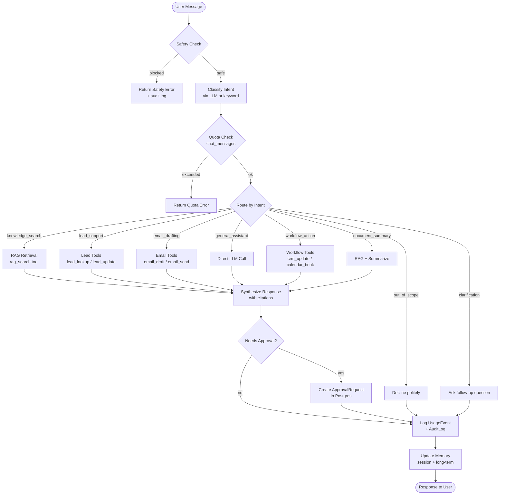

# Agent Workflow

> **Status:** Implemented in Phase 5. Memory, approvals, and usage tracking added in Phase 6.

## Overview

The AI agent uses **LangGraph** for orchestration. It supports multi-step workflows with intent classification, tool calling, human approval gates, and memory. Every chat request flows through the same graph; the path taken depends on the classified intent.

---

## Supported Intents

| Intent | Description |
|--------|-------------|
| `general_assistant` | General business Q&A — answered directly by the LLM |
| `knowledge_search` | RAG-powered knowledge base lookup with citations |
| `lead_support` | Lead qualification and CRM lookup/update |
| `email_drafting` | Draft professional emails; send requires approval |
| `document_summary` | Summarize an uploaded document |
| `workflow_action` | Execute business workflows (calendar, CRM); requires approval |
| `out_of_scope` | Non-business requests declined gracefully |
| `clarification` | Agent asks for more context before proceeding |

---

## Agent State

```python
class AgentState(TypedDict):
    organization_id: str
    user_id: str
    conversation_id: str
    user_message: str
    intent: str | None
    selected_tools: list[str]
    retrieved_context: list[dict]
    tool_results: list[dict]
    draft_output: str | None
    approval_required: bool
    approval_reason: str | None
    citations: list[dict]
    confidence: float
    usage_metadata: dict
    safety_flags: list[str]
```

---

## Workflow Graph



---

## Tool Registry

Tools are registered in `tools/registry.py`. The agent calls tools only through the registry — never directly.

| Tool | Description | Requires Approval |
|------|-------------|-------------------|
| `rag_search` | Semantic search over the knowledge base | No |
| `lead_lookup` | Look up lead by email or ID | No |
| `lead_update` | Update lead status or score | **Yes** |
| `email_draft` | Generate a professional email draft | No |
| `email_send` | Send an approved email draft | **Yes** |
| `calendar_check` | Check calendar availability | No |
| `calendar_book` | Book a meeting | **Yes** |
| `crm_update` | Update CRM records (HubSpot mock) | **Yes** |
| `web_search` | Search the web via Serper (mock fallback) | No |

---

## Approval Gate

When `approval_required=True` in the agent state, the workflow:

1. Creates an `ApprovalRequest` row in Postgres with the proposed action payload
2. Returns a response to the user indicating the action is pending approval
3. The user or an admin reviews the request in the Approvals page
4. On approval: the action is queued for execution
5. On rejection: the request is marked rejected and never retried

This ensures **no external side effects** happen without human review.

---

## Intent Classification Trace

The agent logs the classified intent, confidence, and selected tools to:
- `AuditLog` — for compliance and debugging
- `UsageEvent` — for quota and cost tracking
- LangSmith (if `LANGSMITH_TRACING=true`) — for trace visualization

### Example Trace

```
User: "Can you draft an email to our top leads about the new pricing?"

Intent classified: email_drafting (confidence: 0.92)
Tools selected: lead_lookup, email_draft
lead_lookup → found 3 leads matching criteria
email_draft → generated draft (412 tokens)
approval_required: True (email_send requires approval)
Response: "I've drafted the email below. Please review and approve it before I send."
```

---

## Memory

The agent maintains three tiers of memory, all scoped to `organization_id`:

| Tier | Storage | Description |
|------|---------|-------------|
| Session memory | In-process dict | Current conversation turn context |
| Conversation memory | Postgres | Last N messages per `conversation_id` |
| Long-term memory | Postgres | Named facts the agent has learned about the org |

Long-term memory is written when the agent detects persistent facts (e.g., "Our pricing changed to X"). These facts are retrieved and injected into the system prompt on subsequent conversations.

---

## Error Handling

| Error | Behavior |
|-------|----------|
| Safety flag triggered | Block immediately, log audit event, return safe error message |
| Quota exceeded | Return structured quota error with limit and reset info |
| Tool call failure | Log error, continue with remaining tools, note in response |
| LLM API failure | Fall back to `FallbackLLMProvider`, set `fallback_used=True` |
| Approval creation failure | Return error to user, do not execute the action |
