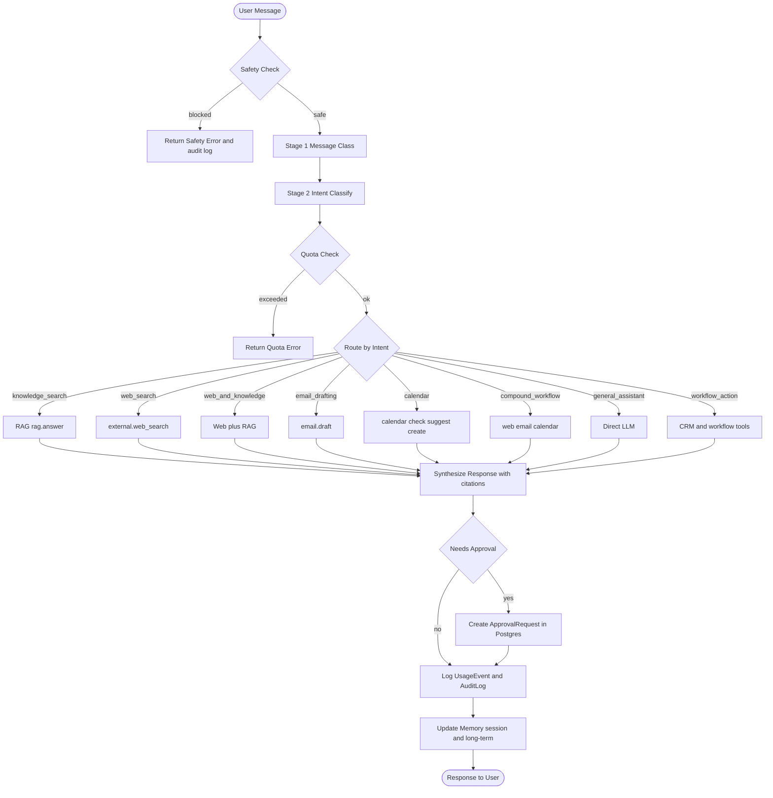

# Agent Workflow

> **Status:** Implemented. Memory, approvals, usage tracking, Serper web search, Gmail, Google Calendar, and compound workflows added in final capstone phase.

## Overview

The AI agent uses **LangGraph** for orchestration. It supports multi-step workflows with **two-stage routing** (message classification, then intent classification), tool calling, human approval gates, and memory. Every chat request flows through the same graph; the path taken depends on the classified message class and intent.

### Two-stage routing

| Stage | Purpose | Output |
|-------|---------|--------|
| **1 — Message class** | Broad bucket (business knowledge, workflow, conversational, etc.) | `MessageClass` |
| **2 — Intent** | Specific tool routing intent | `Intent` |

Stage 1 reduces misroutes for meta questions, corrections, and out-of-scope requests before Stage 2 selects tools.

---

## Supported Intents

| Intent | Description |
|--------|-------------|
| `general_assistant` | General business Q&A — answered directly by the LLM |
| `knowledge_search` | RAG-powered knowledge base lookup with citations |
| `web_search` | External web search via Serper with URL citations |
| `web_and_knowledge` | Hybrid Serper + RAG with separated evidence sections |
| `lead_support` | Lead qualification and CRM lookup/update |
| `email_drafting` | Draft professional emails; Gmail draft after approval |
| `calendar_availability` | Check free/busy across selected Google Calendars |
| `calendar_scheduling` | Suggest slots or propose event creation (approval-gated) |
| `calendar_and_email` | Combined email draft + calendar event proposals |
| `compound_workflow` | Research → email → calendar in one turn |
| `document_summary` | Summarize an uploaded document |
| `workflow_action` | Execute business workflows (CRM mock); requires approval |
| `out_of_scope` | Non-business requests declined gracefully |
| `clarification` | Agent asks for more context before proceeding |

---

## Workflow Graph

---

## Tool Registry

Tools are registered in `tools/registry.py`. The agent calls tools only through the registry — never directly.

| Tool | Description | Requires Approval |
|------|-------------|-------------------|
| `rag.answer` | Internal knowledge base with citations | No |
| `external.web_search` | Serper web search (`web_search` / `web_and_knowledge` / `compound_workflow`) | No |
| `lead_lookup` | Look up lead by email or ID | No |
| `lead_update` | Update lead status or score | **Yes** |
| `email.draft` | Generate email draft in-app (LLM) | No external Gmail call |
| `gmail_create_draft` | Create Gmail draft after approval | **Yes** |
| `gmail_send_email` | Send via Gmail after approval if `GMAIL_SEND_ENABLED` | **Yes** |
| `calendar.check_availability` | Free/busy across selected calendars | No |
| `calendar.suggest_slots` | Propose meeting slots | No |
| `calendar.create_event_request` | Propose calendar event | **Yes** |
| `crm_update` | Update CRM records (HubSpot mock) | **Yes** |

---

## Approval Gate

When `approval_required=True` in the agent state, the workflow:

1. Creates an `ApprovalRequest` row in Postgres with the proposed action payload
2. Returns a response indicating the action is pending approval
3. The user or admin reviews the request on the **Approvals** page
4. On approval: `approval_service` executes via `gmail_service` or `calendar_service`; execution metadata stored on payload (`_execution`)
5. On rejection: marked rejected, never retried automatically

**No external side effects** happen without human review.

---

## Compound Workflow

Prompt example: *Find recent SMB automation trends, draft an email, and schedule a meeting with a high priority lead next week.*

Sequential execution in `compound_workflow_node`:

1. `external.web_search` — external citations
2. `email.draft` → Gmail approval if send/draft requested
3. `calendar.create_event_request` → Calendar approval

Each gated step creates its own approval record.

---

## Calendar Safety

- Availability checks aggregate **selected calendars** (`GOOGLE_CALENDAR_IDS` or primary)
- Responses show busy/free windows only — **event titles are not exposed** to the agent or UI
- Timezone handling uses `GOOGLE_CALENDAR_DEFAULT_TIMEZONE`
- Event creation requires approval; `GOOGLE_CALENDAR_CREATE_ENABLED` can disable creates

---

## Intent Classification Trace

The agent logs classified intent, confidence, and selected tools to:

- `AuditLog` — compliance and debugging
- `UsageEvent` — quota and cost tracking
- LangSmith (if `LANGSMITH_TRACING=true`) — trace visualization

---

## Memory

| Tier | Storage | Description |
|------|---------|-------------|
| Session memory | In-process dict | Current conversation turn context |
| Conversation memory | Postgres | Last N messages per `conversation_id` |
| Long-term memory | Postgres | Named facts learned about the org |

---

## Error Handling

| Error | Behavior |
|-------|----------|
| Safety flag triggered | Block immediately, log audit event, return safe error |
| Quota exceeded | Structured quota error with limit and reset info |
| Tool call failure | Log error, continue with remaining tools, note in response |
| LLM API failure | Fall back to `FallbackLLMProvider`, set `fallback_used=True` |
| Provider unhealthy | Diagnostics surface mode; mock/fallback when configured |
| Approval creation failure | Return error to user, do not execute action |
