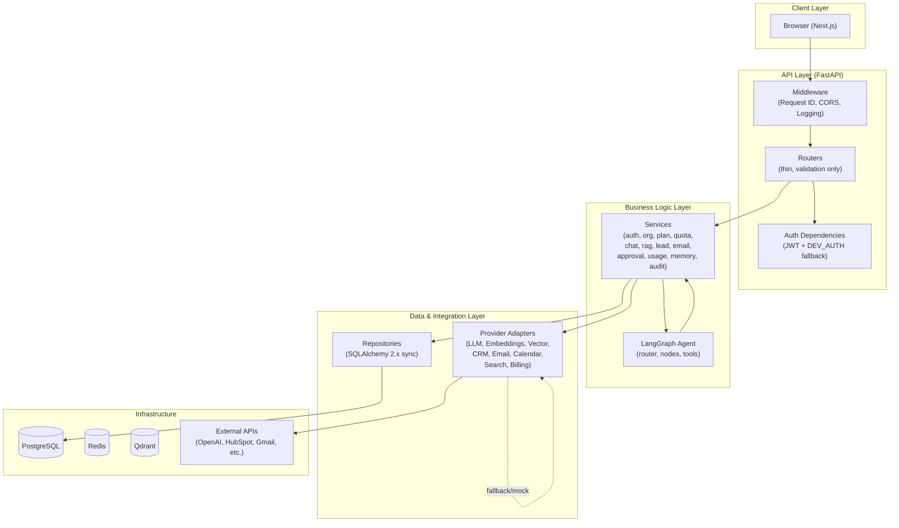
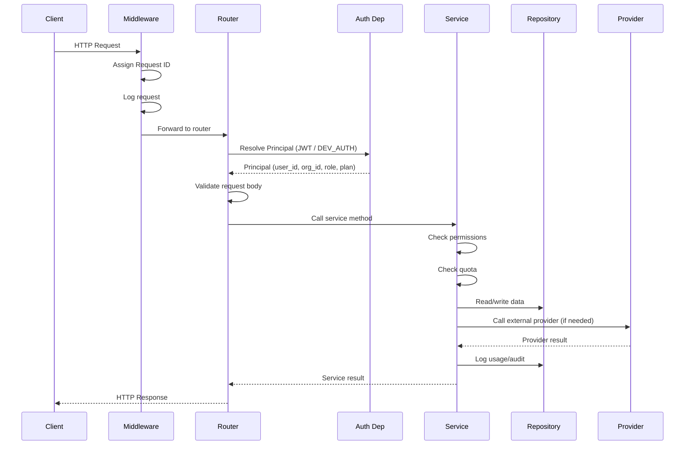
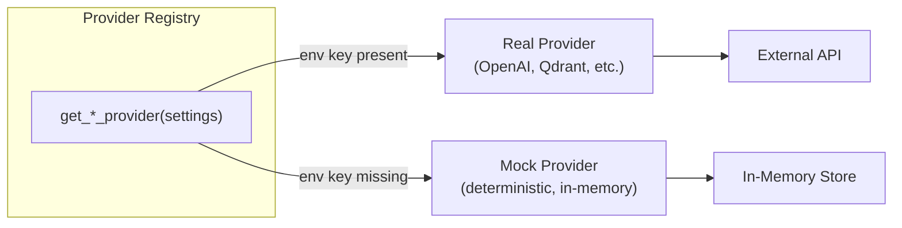
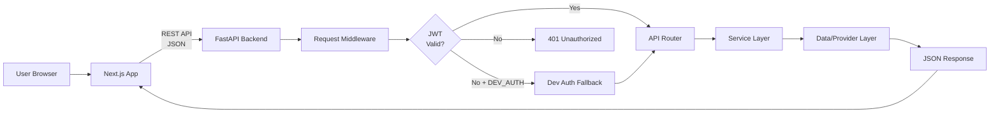
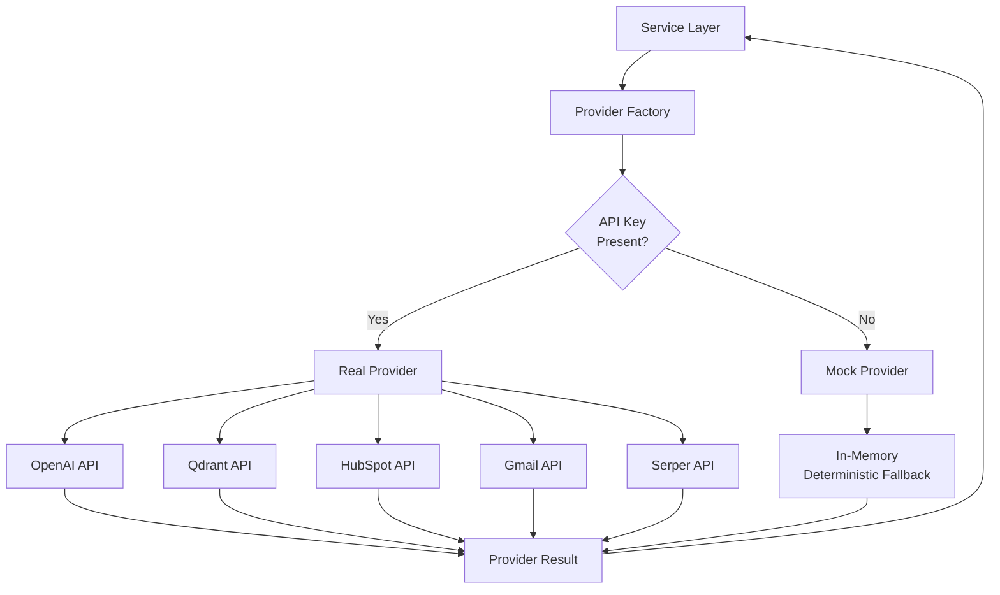
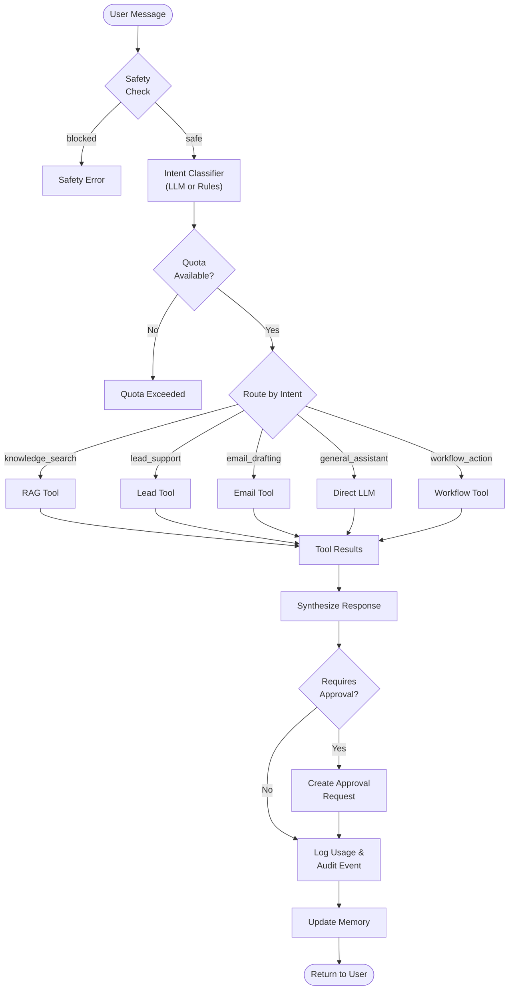

# Architecture

## System Overview

OnePilot AI follows a layered, multi-tenant SaaS architecture. Every layer has a single responsibility and communicates through well-defined interfaces.

## Request Flow

## Layer Responsibilities

| Layer | Responsibility | Rules |
|-------|---------------|-------|
| **Routers** | HTTP validation, routing | No business logic. Call services only. |
| **Services** | Business logic, orchestration | No direct DB queries. Call repos/providers. |
| **Agents** | AI workflow orchestration | Call tools only through tool registry. |
| **Tools** | Bridge between agents and services | Thin wrappers that call services. |
| **Repositories** | Data persistence | Enforce tenant isolation. Own SQL. |
| **Providers** | External system integration | Every provider has a mock/fallback. |
| **Security** | Auth, RBAC, guardrails | Runs before sensitive actions. |

## Provider Adapter Pattern

Every external integration follows the same pattern:

- `base.py` defines the interface (ABC/Protocol)
- Mock providers are deterministic and suitable for tests/demos
- Real providers are activated by setting the appropriate env key
- The registry logs `fallback_used=True` when mocks are active

## Frontend to Backend Flow

## External Provider Integration Flow

## AI Orchestration Flow

## Multilingual Layer

Response language is resolved before agent execution and passed through chat, RAG, and general-chat paths.

| Component | Role |
|-----------|------|
| `LanguageService` | Heuristic detection (EN/DE/FR/ES) with optional OpenAI disambiguation |
| `language_preference` on chat requests | `auto` or fixed `en` / `de` / `fr` / `es` from the workspace UI |
| `RAGService` | Retrieves in source language; optional English query expansion; answers in response language |
| `i18n_messages` | Localized fallback strings when providers are unavailable |
| Frontend `LanguageSelector` | Sets `language_preference` on `/workspace` chat and speech flows |

Citations and document metadata stay in the knowledge base’s original language.

## Multi-Tenant Isolation

- Every business entity is scoped by `organization_id`
- The `TenantMixin` adds `organization_id` to all relevant models
- The `BaseRepository` enforces `organization_id` on all queries
- The `ensure_same_org()` guard prevents cross-tenant access at the service layer
- API dependencies resolve the `Principal` (user_id, org_id, role, plan) from the JWT
