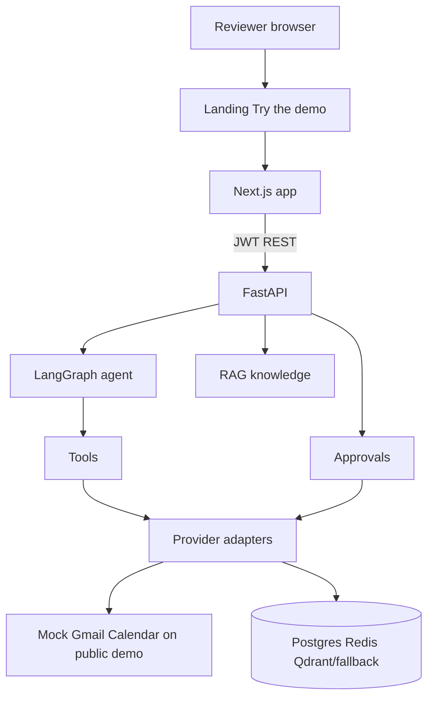
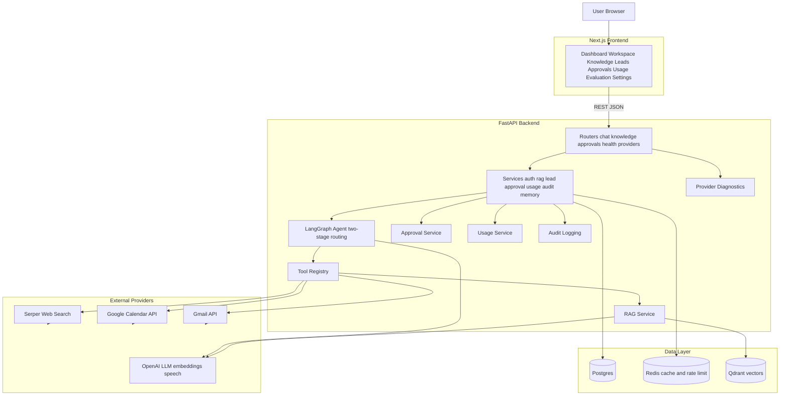
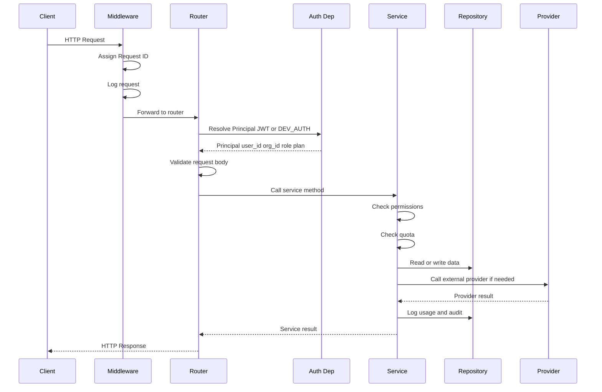
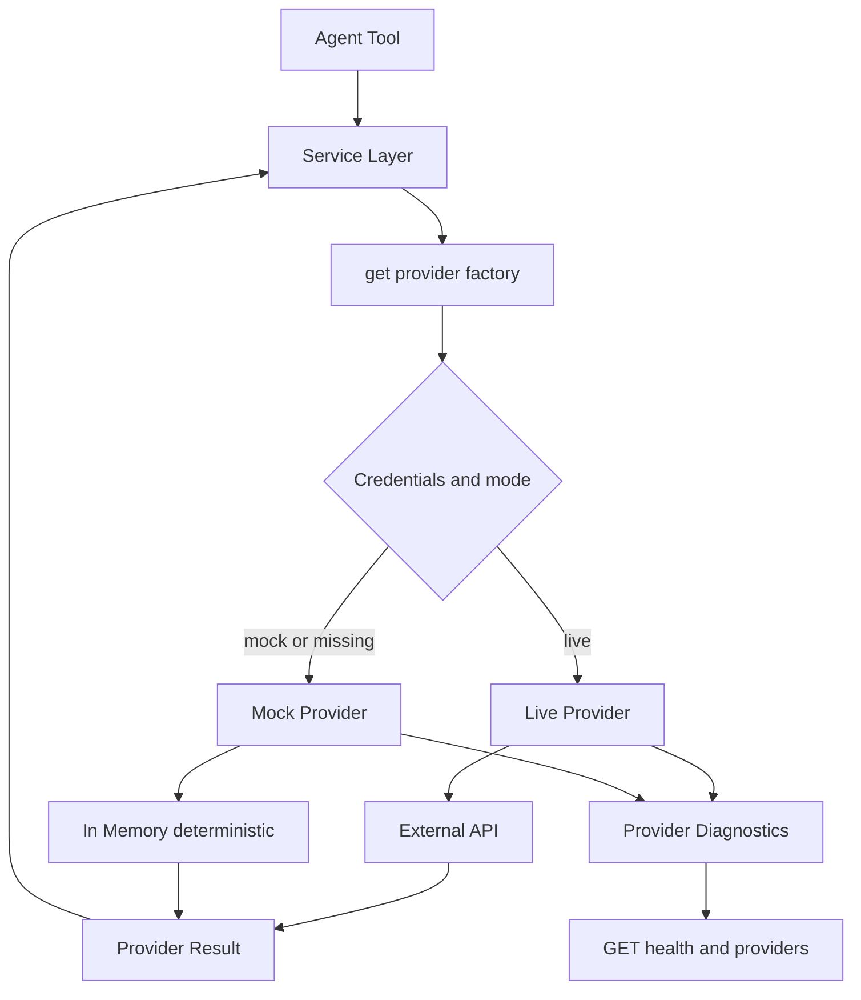
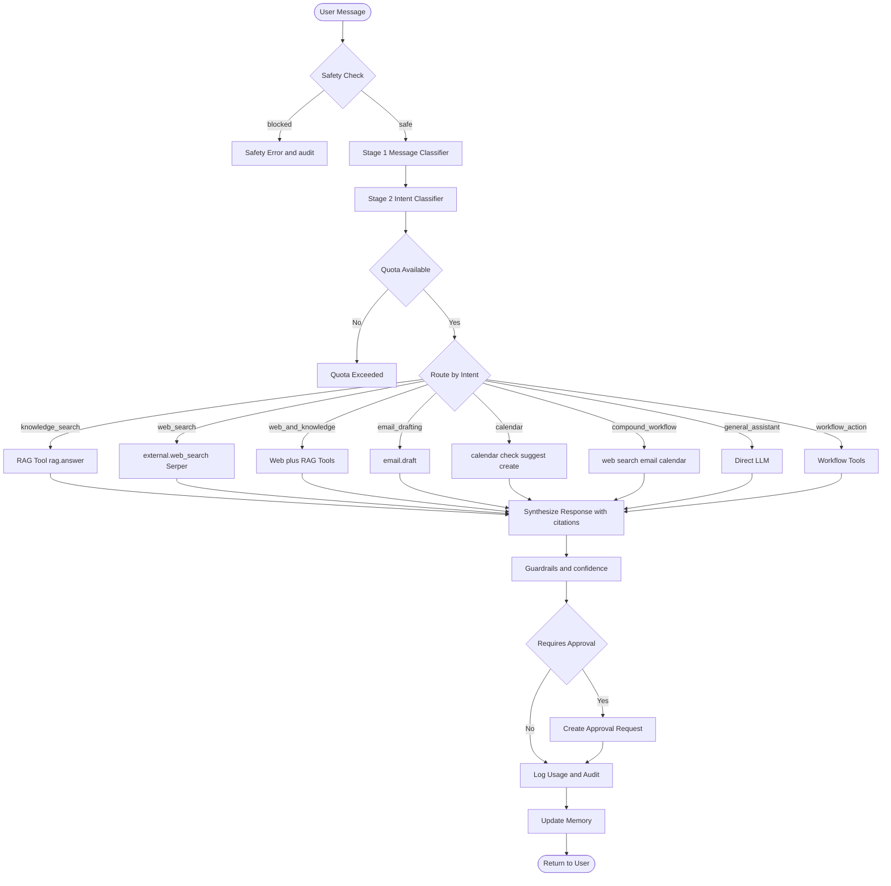
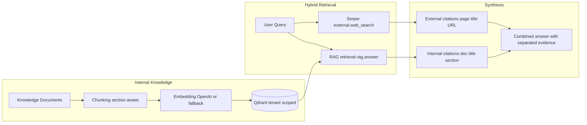
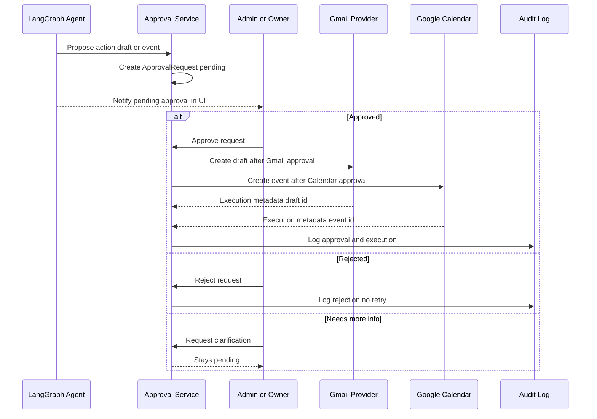
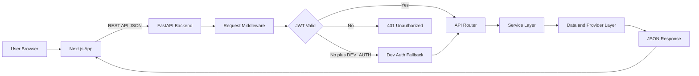

# Architecture

## Recruiter-friendly overview

OnePilot AI is a **multi-tenant AI operations workspace**: a Next.js client talks to a FastAPI backend that runs a LangGraph agent, a RAG pipeline, and approval-gated provider adapters.

| Piece | Role |
|-------|------|
| Frontend | Landing, guided workspace, knowledge, leads, approvals, memory, usage, settings |
| API layer | Thin routers, JWT principal, validation |
| Services | Business logic, quotas, audit, memory, RAG, approvals |
| Agent | Two-stage routing → tools → structured response |
| Providers | OpenAI / Serper / Gmail / Calendar / Stripe / HubSpot with mock or live modes |
| Data | PostgreSQL (tenant-scoped), Redis (rate limits), Qdrant or in-memory vectors |

**Public demo track:** Vercel frontend + Railway backend. Gmail and Calendar are **mock**. Shared-demo agent memory is disabled and cleared on demo start. See [capabilities.md](capabilities.md) and [safety_and_privacy.md](safety_and_privacy.md).

## System Overview

OnePilot AI follows a layered, multi-tenant SaaS architecture. Every layer has a single responsibility and communicates through well-defined interfaces.

### System architecture

## Request Flow

## Layer Responsibilities

| Layer | Responsibility | Rules |
|-------|---------------|-------|
| **Routers** | HTTP validation, routing | No business logic. Call services only. |
| **Services** | Business logic, orchestration | No direct DB queries. Call repos/providers. |
| **Agents** | AI workflow orchestration | Call tools only through tool registry. |
| **Tools** | Bridge between agents and services | Thin wrappers that call services. |
| **Repositories** | Data persistence | Enforce tenant isolation. Own SQL. |
| **Providers** | External system integration | Every provider has mock/fallback/live modes. |
| **Security** | Auth, RBAC, guardrails | Runs before sensitive actions. |

## Provider Adapter Pattern

Every external integration follows the same pattern with diagnostics and safe fallback:

- `base.py` defines the interface (ABC/Protocol)
- Mock providers are deterministic and suitable for tests/demos
- Live providers are activated by setting the appropriate env keys
- `/providers` and Settings show mode without exposing secrets
- The registry logs `fallback_used=True` when mocks are active

## AI Orchestration Flow

## RAG and Hybrid Retrieval

Internal knowledge and external web search are kept separate end-to-end:

## Approval Workflow

External side effects never run without human review:

Gmail **send** remains disabled by default (`GMAIL_SEND_ENABLED=false`). Calendar availability and slot suggestions do not require approval; event creation does.

## Frontend to Backend Flow

## Multilingual Layer

Response language is resolved before agent execution and passed through chat, RAG, and general-chat paths.

| Component | Role |
|-----------|------|
| `LanguageService` | Heuristic detection EN DE FR ES with optional OpenAI disambiguation |
| `language_preference` on chat requests | auto or fixed en de fr es from workspace UI |
| `RAGService` | Retrieves in source language optional English expansion answers in response language |
| `i18n_messages` | Localized fallback strings when providers unavailable |
| Frontend language selector | Sets language_preference on workspace chat and speech only one selector |

Citations and document metadata stay in the knowledge base original language.

## Multi-Tenant Isolation

- Every business entity is scoped by `organization_id`
- The `TenantMixin` adds `organization_id` to all relevant models
- The `BaseRepository` enforces `organization_id` on all queries
- The `ensure_same_org()` guard prevents cross-tenant access at the service layer
- API dependencies resolve the `Principal` user_id org_id role plan from the JWT

See [data_model.md](data_model.md) for entity relationships.
