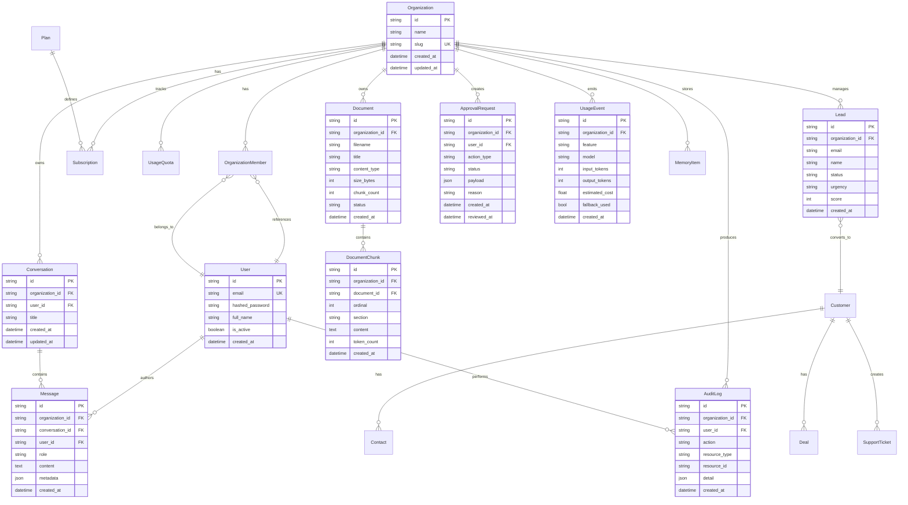

# Data Architecture

This document describes the data storage design, entity relationships, and storage layer architecture for OnePilot AI.

---

## Storage Overview

OnePilot AI uses a **polyglot persistence** strategy:

| Store | Purpose | Technology |
|-------|---------|------------|
| **Relational DB** | Structured business data, tenancy, auth | PostgreSQL 16 |
| **Cache** | Session data, rate limiting, temp storage | Redis 7 |
| **Vector DB** | Document embeddings, semantic search | Qdrant (or in-memory fallback) |

---

## Main Data Entities

### Core Entities

1. **Organization** — tenant root entity
2. **User** — individual users (can belong to multiple orgs)
3. **OrganizationMember** — join table linking users to organizations with roles
4. **Plan** — subscription plan definitions (Free, Pro, Team, Business)
5. **Subscription** — active plan subscription per organization
6. **UsageQuota** — per-org quota tracking (chat messages, documents, storage, etc.)

### Knowledge & Documents

7. **Document** — uploaded files with metadata (filename, size, content type, status)
8. **DocumentChunk** — text segments extracted from documents, each with ordinal position

### AI & Conversations

9. **Conversation** — chat session scoped to organization and user
10. **Message** — individual turns within a conversation (user/assistant)
11. **MemoryItem** — long-term facts the agent learns about an organization

### Business Operations

12. **Lead** — sales leads with qualification status and urgency
13. **Customer** — converted leads or existing customers
14. **Contact** — people associated with customers
15. **Deal** — sales opportunities
16. **SupportTicket** — customer support requests

### Agent Workflow

17. **ApprovalRequest** — human-in-the-loop approval queue for agent actions
18. **EmailDraft** — AI-generated email drafts awaiting approval

### Observability

19. **AuditLog** — append-only audit trail for all sensitive actions
20. **UsageEvent** — granular per-call tracking (tokens, cost, latency)

---

## Entity Relationship Diagram

---

## Storage Design by Layer

### PostgreSQL (Relational)

**Purpose:** Structured business data, ACID transactions, tenant isolation

**Schema Design:**
- Every table includes `organization_id` for tenant scoping (except `User`, `Plan`)
- `TenantMixin` base class enforces this pattern
- All IDs are UUIDv4 strings for public-facing safety
- Timestamps use UTC with `datetime` columns

**Key Indexes:**
- Primary keys on all `id` columns
- Foreign key indexes on all `*_id` columns
- Composite indexes on `(organization_id, created_at)` for time-series queries
- Unique index on `Organization.slug`
- Unique index on `User.email`

**Migrations:**
- Alembic for schema versioning
- Auto-generated migrations from SQLAlchemy models
- Applied via `alembic upgrade head`

---

### Redis (Cache)

**Purpose:** Session state, rate limiting, temporary data

**Current Usage:**
- **Rate Limiting:** Token bucket counters per `organization_id`
- **Session Cache:** (planned) JWT blacklist, session metadata
- **Temporary Results:** (planned) long-running agent results

**Fallback:** If Redis is unavailable, rate limiting falls back to in-memory (not suitable for multi-instance deployments)

**TTL Strategy:**
- Rate limit counters: 60 seconds (sliding window)
- Session cache: aligned with `JWT_EXPIRE_MINUTES`

---

### Qdrant (Vector DB)

**Purpose:** Semantic search over document chunks

**Collection Design:**
- One collection per organization: `org_{organization_id}`
- Each vector is a document chunk with metadata:
  - `document_id`
  - `chunk_ordinal`
  - `section`
  - `content` (stored in payload, not indexed)
- Vector dimension: 1536 (OpenAI `text-embedding-3-small`)

**Search Strategy:**
- Query is embedded using the same embedding model
- Cosine similarity search retrieves top K chunks
- Results are filtered by `organization_id` at the collection level (tenant isolation)
- Chunks below similarity threshold (0.7) are excluded

**Fallback:** If `QDRANT_URL` is not set, an in-memory vector store is used (not persisted across restarts)

---

## Demo Data Structure

The demo dataset is based on **NovaEdge Solutions**, a fictional company with:

- **1 Organization:** `org_demo_onepilot`
- **1 User:** `admin@novaedge.io` (Owner role)
- **19 Documents:** Company docs, sales playbooks, FAQs, policies, templates
- **~150 DocumentChunks:** Chunked from the 19 documents
- **10 Leads:** Various qualification statuses (new, contacted, qualified, etc.)
- **5 ApprovalRequests:** Pending and reviewed actions
- **50+ UsageEvents:** Historical LLM/embedding usage
- **30+ AuditLogs:** User actions, document uploads, approval decisions

The demo is seeded via `python scripts/seed_demo.py`, which:
1. Calls `POST /demo/setup` to upsert the demo org and user
2. Calls `POST /demo/seed` to ingest all 19 NovaEdge documents
3. Verifies the documents are visible via `GET /documents`

---

## Redis Role

**Current:**
- Rate limiting state (token bucket counters)
- Optional cache for provider results (not yet implemented)

**Planned:**
- Session management for multi-device auth
- JWT blacklist for logout
- Caching expensive RAG results
- Message broker for background job queue

---

## Postgres Role

**Primary Data Store:**
- All business entities
- User authentication credentials (bcrypt hashed passwords)
- Tenant membership and RBAC
- Document metadata (not content — content is in chunks)
- Approval workflow state
- Audit logs
- Usage tracking

**Why Postgres:**
- ACID guarantees for critical business data
- Rich query capabilities (joins, aggregations, window functions)
- Mature tooling (Alembic, SQLAlchemy, pgAdmin)
- JSON column support for flexible metadata
- Full-text search capabilities (for future use)

---

## Vector DB / Retrieval Role

**Purpose:**
- Semantic search over ingested documents
- Retrieval-augmented generation (RAG)
- Citation extraction

**Why Qdrant:**
- Native support for filtered search (tenant isolation)
- High-performance cosine similarity
- Payload storage for chunk metadata
- REST API for easy integration
- Docker-friendly deployment

**Fallback:** In-memory vector store using `InMemoryVectorProvider` when Qdrant is unavailable

---

## Data Isolation

All data access enforces **organization_id** scoping at multiple layers:

1. **Repository Layer** — `BaseRepository` automatically filters by `organization_id`
2. **Service Layer** — `ensure_same_org()` guard validates cross-references
3. **API Layer** — `Principal` resolved from JWT contains `organization_id`
4. **Vector Store** — separate collections per organization

This **defense-in-depth** approach prevents cross-tenant data leaks even if a single layer fails.

---

## Backup & Recovery Strategy (Production Recommendation)

**Not currently implemented** (Docker Compose development only), but recommended for production:

1. **Postgres:**
   - Daily automated backups via `pg_dump`
   - Point-in-time recovery (PITR) with WAL archiving
   - Backup retention: 30 days

2. **Redis:**
   - AOF (Append-Only File) persistence enabled
   - RDB snapshots every 6 hours
   - Backup to object storage (S3 / R2)

3. **Qdrant:**
   - Snapshot API for collection backups
   - Sync to object storage after every ingestion batch

---

## Scalability Considerations

**Current Limitations:**
- Single Postgres instance (no read replicas)
- Single Redis instance (no clustering)
- Single Qdrant instance (no sharding)

**Production Scaling Path:**
1. Add Postgres read replicas for query scaling
2. Redis Cluster for distributed rate limiting
3. Qdrant sharding by organization cohort
4. CDN for frontend static assets
5. Background job queue (Celery + Redis) for async processing
