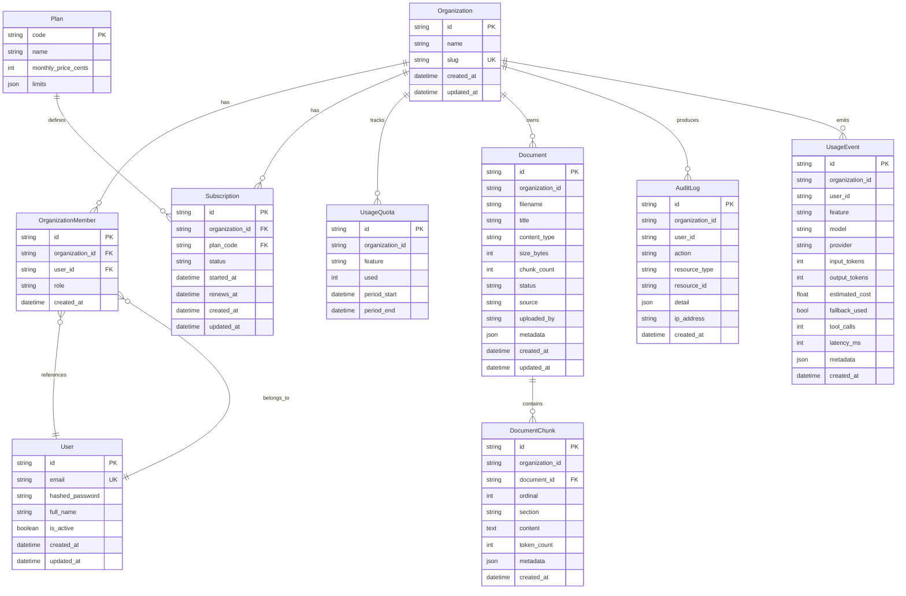

# Data Model

## Phase 4 Entity Relationship Diagram

## Plan Limits

| Feature | Free | Pro | Team | Business |
|---------|------|-----|------|----------|
| Chat Messages | 50 | 500 | 2,000 | 10,000 |
| RAG Queries | 20 | 200 | 1,000 | 5,000 |
| Document Uploads | 5 | 50 | 200 | 1,000 |
| Storage (MB) | 100 | 1,000 | 5,000 | 25,000 |
| Email Drafts | 10 | 100 | 500 | 2,000 |
| Lead Workflows | 5 | 50 | 200 | 1,000 |
| Tool Calls | 30 | 300 | 1,000 | 5,000 |
| Users | 1 | 1 | 10 | 50 |

## Roles

| Role | Permissions |
|------|------------|
| Owner | Full admin — manage org, team, data, settings, billing |
| Admin | Manage team, data, settings |
| Member | Use AI tools, read data |
| Viewer | Read-only access |

## Phase 4 Entities

- **Document** — uploaded files with metadata; soft-linked to chunks via `document_id`.
- **DocumentChunk** — section-aware text segments, embedded into the tenant vector store.
- **AuditLog** — append-only record of every AI / tool action with `organization_id`,
  `user_id`, `action`, `resource_type`, and `detail`.
- **UsageEvent** — granular token / latency / cost record for every LLM, embedding, or
  tool call.

All four are tenant-scoped: every read enforces `organization_id` at the repository layer.

## Future Entities (Phase 5+)

These entities will be added in later phases:

- **Conversation / Message** — chat sessions and individual turns.
- **Lead** — sales leads with status, urgency, source.
- **Customer** — converted leads / existing customers.
- **Contact** — people associated with customers.
- **Deal** — sales opportunities.
- **SupportTicket** — customer support requests.
- **EmailDraft** — AI-generated email drafts.
- **ApprovalRequest** — human-in-the-loop approval queue.
- **AgentAction** — individual agent tool calls and results.
- **WorkflowRun** — full agent workflow execution trace.
- **MemoryItem** — persistent user/org memory for the agent.

## Demo Data (Phase 3)

The fictional company **NovaEdge Solutions** provides realistic demo data via
`backend/src/onepilot/demo_data/`:

- 19 knowledge base markdown documents under `novaedge_docs/` (company profile,
  services, pricing, sales playbook, objection handling, integration guide,
  customer FAQ, support troubleshooting, escalation policy, refund policy,
  onboarding guide, customer success SOP, data privacy, AI usage, security,
  email templates, discovery script, demo checklist, sample meeting notes).
- Deterministic structured generators (`generators.py`) producing leads,
  customers, support tickets, conversations, email examples, appointments,
  usage events, approvals, and audit logs. All generators accept a `seed`
  parameter; the default seed `42` produces the canonical dataset used by tests.
- An idempotent `POST /demo/seed` endpoint that ingests all 19 docs into the
  caller's organization.
