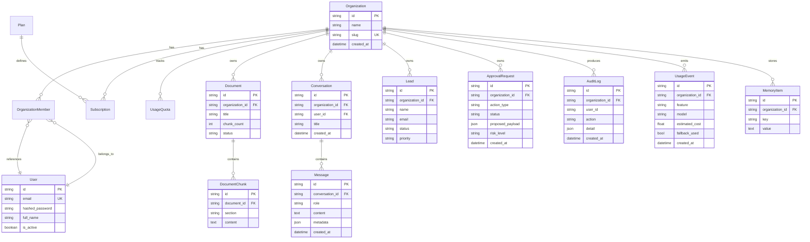

# Data Model

## Entity Relationship Diagram

## Provider Diagnostics (runtime, not persisted)

Provider health is computed at request time from env configuration and live probes. Exposed via `GET /health` and `GET /providers` — **never stores OAuth tokens or API keys**.

| Field | Source |
|-------|--------|
| `mode` | live / mock / missing / optional / unhealthy |
| `capabilities` | e.g. draft, send, availability, create_event |
| `requires_approval` | HITL policy flags |

---

## Plan Limits

| Feature | Free | Pro | Team | Business |
|---------|------|-----|------|----------|
| Chat Messages | 50 | 500 | 2,000 | 10,000 |
| RAG Queries | 20 | 200 | 1,000 | 5,000 |
| Document Uploads | 5 | 50 | 200 | 1,000 |
| Storage (MB) | 100 | 1,000 | 5,000 | 25,000 |
| Email Drafts | 10 | 100 | 500 | 2,000 |
| Lead Workflows | 5 | 50 | 200 | 1,000 |
| Tool Calls | 30 | 300 | 1,000 | 5,000 |
| Users | 1 | 1 | 10 | 50 |

## Roles

| Role | Permissions |
|------|------------|
| Owner | Full admin — manage org, team, data, settings, billing |
| Admin | Manage team, data, settings |
| Member | Use AI tools, read data |
| Viewer | Read-only access |

## Core Entities

- **Document / DocumentChunk** — uploaded files, section-aware chunks, tenant-scoped Qdrant collections
- **Conversation / Message** — chat sessions and turns with intent/tool metadata
- **Lead** — sales leads with status, priority, source (seeded demo data)
- **ApprovalRequest** — human-in-the-loop queue for Gmail, Calendar, CRM actions
- **AuditLog** — append-only sensitive action log
- **UsageEvent** — token, latency, cost per LLM/tool call
- **MemoryItem** — persistent org/conversation facts for the agent

All entities enforce `organization_id` at the repository layer.

## Demo Data

The fictional company **NovaEdge Solutions** provides realistic demo data via `backend/src/onepilot/demo_data/`:

- 19 knowledge base markdown documents
- 12 leads, 8 approvals (with pending items), 40 usage events, 25 audit log entries
- Idempotent `POST /demo/seed` and `docker compose run --rm seed`
