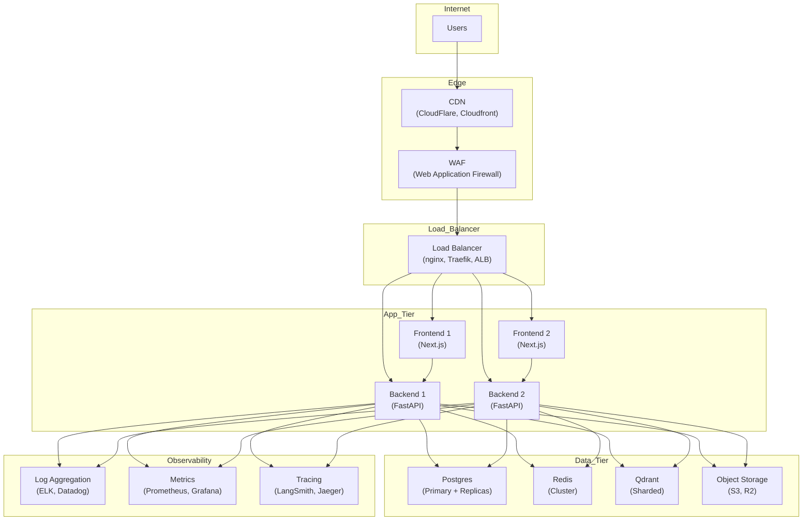

# Deployment Guide

This document describes how to run OnePilot AI locally, in Docker, and considerations for production deployment.

---

## Docker Setup

OnePilot AI uses **Docker Compose** to orchestrate all services:
- PostgreSQL 16
- Redis 7
- Qdrant (vector DB)
- Backend (FastAPI)
- Frontend (Next.js)

### Prerequisites
- Docker 20.10+
- Docker Compose 2.0+
- 4GB RAM minimum
- 10GB disk space

### Quick Start (Full Stack)

```bash
# 1. Clone the repository
git clone <repo-url>
cd OnePilot-AI

# 2. Copy environment file
cp .env.example .env
# Edit .env — set OPENAI_API_KEY if you want real LLM responses (optional)

# 3. Build images
docker compose build

# 4. Start all services
docker compose up -d

# 5. Run migrations
docker compose run --rm migrate

# 6. Seed demo data
docker compose run --rm seed

# 7. Verify services
docker compose ps
docker compose logs -f backend
```

### Access the Application

- **Frontend:** http://localhost:3000
- **Backend API docs:** http://localhost:8000/docs
- **Backend health:** http://localhost:8000/health
- **Qdrant dashboard:** http://localhost:6333/dashboard

### Demo Login

After seeding, use:
- **Email:** `admin@novaedge.io`
- **Password:** `Demo1234!`

Or use dev auth mode (enabled by default) — access the app without credentials.

---

## Local Backend Run (Without Docker)

### Prerequisites
- Python 3.11+
- PostgreSQL 16 (running locally or via Docker)
- Redis 7 (optional, falls back to in-memory)
- Qdrant (optional, falls back to in-memory)

### Setup

```bash
# 1. Start infrastructure only
docker compose up -d postgres redis qdrant

# Or use the Makefile
make infra

# 2. Install backend dependencies
cd backend
pip install -e ".[dev]"

# 3. Run migrations
alembic upgrade head

# Or use the Makefile
make backend-migrate

# 4. Start backend dev server
uvicorn onepilot.api.main:app --reload --port 8000

# Or use the Makefile
make backend-dev

# 5. In a separate terminal, seed demo data
cd backend
python scripts/seed_demo.py

# Or use the Makefile
make backend-seed
```

### Environment Variables

Create a `.env` file in the project root:

```bash
cp .env.example .env
```

**Required:**
- `DATABASE_URL` — PostgreSQL connection string
- `JWT_SECRET` — Secret key for signing JWTs (change in production!)

**Optional (with fallbacks):**
- `OPENAI_API_KEY` — for real LLM/embeddings (uses deterministic fallback without it)
- `REDIS_URL` — for caching and rate limiting (in-memory fallback)
- `QDRANT_URL` — for vector search (in-memory fallback)
- `SERPER_API_KEY` — for web search (mock results without it)
- `LANGSMITH_API_KEY` — for LangSmith tracing (disabled by default)

See [.env.example](.env.example) for full list.

---

## Local Frontend Run (Without Docker)

### Prerequisites
- Node.js 20+
- pnpm 8+ (install via `npm install -g pnpm`)

### Setup

```bash
# 1. Install dependencies
cd frontend
pnpm install

# Or use the Makefile
make frontend-install

# 2. Copy frontend environment file
cp .env.example .env.local

# Edit .env.local:
# NEXT_PUBLIC_API_URL=http://localhost:8000

# 3. Start dev server
pnpm dev

# Or use the Makefile
make frontend-dev
```

### Access the Application
- **Frontend:** http://localhost:3000
- **Hot reload:** Enabled by default in dev mode

---

## Environment Variables Reference

### Backend Environment Variables

| Variable | Required | Default | Description |
|----------|----------|---------|-------------|
| `APP_ENV` | No | `dev` | Environment: `dev` or `production` |
| `APP_NAME` | No | `OnePilot AI` | Application name |
| `DATABASE_URL` | **Yes** | — | PostgreSQL connection string |
| `REDIS_URL` | No | — | Redis connection string (optional) |
| `QDRANT_URL` | No | — | Qdrant base URL (optional) |
| `QDRANT_API_KEY` | No | — | Qdrant API key for cloud instances |
| `OPENAI_API_KEY` | No | — | OpenAI API key (optional, uses fallback) |
| `OPENAI_MODEL` | No | `gpt-4o-mini` | Chat completion model |
| `OPENAI_EMBEDDING_MODEL` | No | `text-embedding-3-small` | Embedding model |
| `LANGSMITH_API_KEY` | No | — | LangSmith tracing API key (optional) |
| `LANGSMITH_TRACING` | No | `false` | Enable LangSmith trace export |
| `SERPER_API_KEY` | No | — | Serper web search API key (optional) |
| `JWT_SECRET` | **Yes** | `change-me-...` | Secret for signing JWTs — **change in production!** |
| `JWT_ALGORITHM` | No | `HS256` | JWT signing algorithm |
| `JWT_EXPIRE_MINUTES` | No | `60` | JWT expiry in minutes |
| `DEV_AUTH_ENABLED` | No | `true` | Bypass JWT in dev mode (disable in production) |
| `DEV_ORG_ID` | No | `org_demo_onepilot` | Default org ID for dev auth |
| `DEV_USER_ID` | No | `usr_demo_admin` | Default user ID for dev auth |
| `DEV_BYPASS_QUOTAS` | No | `false` | Skip quota checks in dev mode |

### Frontend Environment Variables

| Variable | Required | Default | Description |
|----------|----------|---------|-------------|
| `NEXT_PUBLIC_API_URL` | **Yes** | `http://localhost:8000` | Backend API base URL (baked into build) |

---

## Deployment Readiness

### What Works
✅ **Docker Compose orchestration** — all services start together  
✅ **Health checks** — backend, Postgres, Redis, Qdrant  
✅ **Multi-stage Docker builds** — optimized for production  
✅ **Non-root containers** — security best practice  
✅ **Persistent volumes** — Postgres, Redis, Qdrant data is retained  
✅ **Migrations** — Alembic migrations run via `docker compose run --rm migrate`  
✅ **Seed data** — Demo data seeding via `docker compose run --rm seed`  

### Production Gaps

**Not production-ready** (Docker Compose is for local/dev only):

❌ **No horizontal scaling** — single instance of each service  
❌ **No load balancer** — no reverse proxy (add nginx/Traefik)  
❌ **No HTTPS** — HTTP only (terminate TLS at reverse proxy)  
❌ **No secret management** — `.env` file with plaintext secrets (use AWS Secrets Manager, Vault, etc.)  
❌ **No CI/CD** — manual build and deploy  
❌ **No monitoring** — no Prometheus, Grafana, Sentry  
❌ **No log aggregation** — logs are written to stdout only (add ELK, Datadog, etc.)  
❌ **No backup automation** — Postgres/Redis backups are manual  

---

## Runtime Modes

### Development Mode (`APP_ENV=dev`)
- **Dev auth enabled:** Access without JWT (if `DEV_AUTH_ENABLED=true`)
- **Hot reload:** Backend and frontend auto-reload on code changes
- **Verbose logging:** DEBUG level logs to stdout
- **Mock providers:** Fallback providers are acceptable
- **CORS:** Permissive (localhost origins)

### Production Mode (`APP_ENV=production`)
- **Dev auth disabled:** Must set `DEV_AUTH_ENABLED=false`
- **JWT required:** All API requests must include `Authorization: Bearer <token>`
- **Structured logging:** JSON logs with request IDs
- **Real providers:** Mock providers log warnings
- **CORS:** Strict origin whitelist
- **Secret management:** Use environment variables injected by orchestrator

---

## Known Deployment Limitations

1. **No Kubernetes manifests** — Docker Compose only
2. **No cloud-native deployment** — no AWS ECS, GCP Cloud Run, Azure Container Instances examples
3. **No autoscaling** — fixed resource limits
4. **No multi-region** — single-region deployment
5. **No CDN** — frontend static assets served directly by Next.js
6. **No object storage** — uploaded files are not persisted (chunks are stored in Postgres)
7. **No message queue** — no async job processing (add Celery/RabbitMQ/Redis)
8. **No rate limiting at proxy** — rate limiting is in-memory in the backend (resets on restart)

See [limitations_roadmap.md](limitations_roadmap.md) for the full list.

---

## Recommended Production Architecture



---

## Makefile Targets

The `Makefile` provides convenience commands for local development:

### Infrastructure
```bash
make infra           # Start Postgres, Redis, Qdrant
make infra-down      # Stop infrastructure containers
```

### Backend
```bash
make backend-install # Install backend dependencies
make backend-migrate # Run Alembic migrations
make backend-seed    # Seed demo data
make backend-dev     # Start backend dev server
make backend-test    # Run pytest suite
make backend-lint    # Run Ruff linter
```

### Frontend
```bash
make frontend-install # Install frontend dependencies
make frontend-dev     # Start Next.js dev server
make frontend-build   # Production build
make frontend-test    # Run Vitest tests
make frontend-lint    # Run ESLint + tsc typecheck
```

### Docker
```bash
make docker-build    # Build all Docker images
make docker-up       # Start full stack
make docker-down     # Stop and remove containers
make docker-logs     # Follow logs
make docker-migrate  # Run migrations in Docker
make docker-seed     # Seed data in Docker
```

### Quality
```bash
make test            # Run all tests (backend + frontend)
make lint            # Run all linters (backend + frontend)
make check-stack     # Verify all services are healthy
```

### First-Time Setup
```bash
make setup           # Full setup: infra + install + migrate + seed
```

---

## Troubleshooting

### Backend won't start
**Symptom:** `uvicorn` exits immediately

**Fixes:**
1. Check `DATABASE_URL` is correct
2. Ensure Postgres is running and reachable
3. Check logs: `docker compose logs backend`

### Frontend can't reach backend
**Symptom:** API requests return network errors

**Fixes:**
1. Verify `NEXT_PUBLIC_API_URL` is set in `frontend/.env.local`
2. Ensure backend is running on port 8000
3. Check CORS settings in `backend/src/onepilot/api/main.py`

### Migrations fail
**Symptom:** `alembic upgrade head` exits with error

**Fixes:**
1. Check Postgres connection: `psql $DATABASE_URL`
2. Verify `alembic/versions/` contains migration files
3. Reset database (destructive): `docker compose down -v && docker compose up -d postgres`

### Seed script fails
**Symptom:** `python scripts/seed_demo.py` exits with error

**Fixes:**
1. Ensure backend is running and healthy: `curl http://localhost:8000/health`
2. Verify migrations are applied: `alembic current`
3. Check backend logs for errors

### Docker build fails
**Symptom:** `docker compose build` exits with error

**Fixes:**
1. Check Docker has enough disk space: `docker system df`
2. Prune old images: `docker system prune -a`
3. Verify Dockerfile syntax

---

## Summary

OnePilot AI is **deployment-ready for local development and testing** via Docker Compose.

For **production deployment**, additional infrastructure is required:
- Kubernetes or cloud-native orchestrator
- Load balancer with TLS termination
- Secret management (Vault, AWS Secrets Manager)
- Log aggregation and monitoring
- Backup automation
- Autoscaling policies

See **Recommended Production Architecture** above for a scalable setup.
