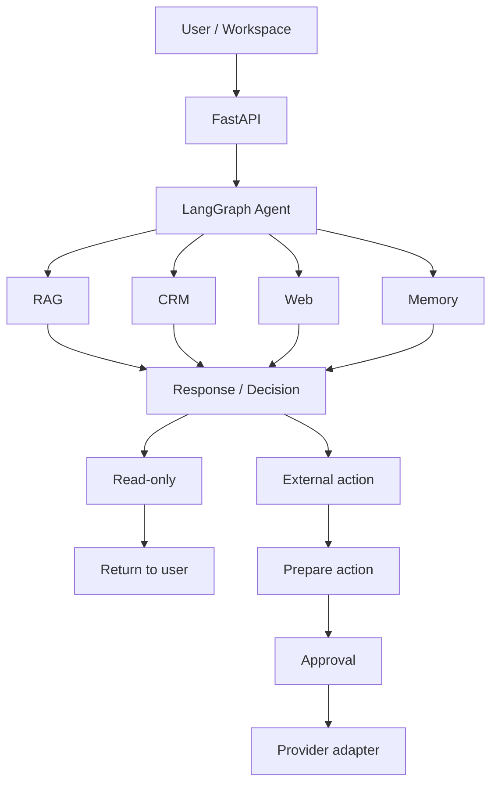

# Architecture Overview — OnePilot AI

30–60 second technical scan after the [README](../../README.md).

This is not a substitute for the deep implementation document:
**[docs/architecture.md](../architecture.md)**

**Live public demo:** [https://one-pilot-ai.vercel.app](https://one-pilot-ai.vercel.app)  
**Also:** [agent workflow](../agent_workflow.md) · [RAG](../rag_system.md) · [capabilities](../capabilities.md)

---

## Two tracks

| Track | What it proves | What stays restricted |
|-------|----------------|------------------------|
| **Public recruiter demo** | Live OpenAI, embeddings, Qdrant, Postgres, Redis, Serper, routing, RAG, citations, traces, HITL | Gmail simulated · Calendar writes simulated · speech disabled · shared-demo memory disabled |
| **Private authenticated track** | Real Gmail **draft** creation, real Calendar **event** creation, voice, tenant-scoped memory | Still approval-gated · Gmail **send disabled** · org-restricted · not a public CTA |

The public track proves real AI infrastructure without exposing anonymous users
to write-capable Google integrations. The private track validates the live
provider path in a controlled environment.

Public runtime model: **`gpt-5-nano`**. Local repo default: `gpt-4o-mini`.
Those are different claims.

---

## System at a glance

Most requests are **read / reason** only. Approval is required only for
sensitive external side effects, not for RAG, web research, CRM reads, or
availability checks.



Underneath: **PostgreSQL · Redis · Qdrant**  
Providers: **OpenAI · Serper · Gmail · Google Calendar**

Gmail and Calendar are **simulated on public**, **live only on the private
authenticated track**. MCP, HubSpot, Salesforce, Stripe, Slack, and Twilio are
not live.

The browser never talks to models or providers directly. FastAPI owns auth and
tenancy. LangGraph decides the path. Tools go through a registry. Ordinary
answers return to the user. External writes stop at human approval.

| Layer | What it does |
|-------|----------------|
| Next.js | Landing, workspace, knowledge, leads, approvals, evaluation |
| FastAPI | Thin routers, JWT principal, validation, quotas |
| LangGraph | Two-stage routing, tool selection, structured response |
| Tools | RAG, CRM, email draft, calendar, Serper — never call providers directly |
| HITL | `ApprovalRequest` in Postgres before any external side effect |
| Adapters | OpenAI / Serper live; Gmail / Calendar mock on public, live on private |
| Data | Postgres (tenant rows), Redis (rate limits), Qdrant (vectors) |

---

## Request lifecycle

1. Browser hits Next.js. **Try the demo** calls `POST /demo/start` and stores a short-lived JWT.
2. FastAPI middleware assigns a request ID, then resolves a `Principal` (`user_id`, `organization_id`, role, plan).
3. The router validates the body and hands off to a service. Routers do not own business logic.
4. Chat goes through safety checks, then the LangGraph graph: message class → intent → tools → synthesis.
5. The service writes usage and audit rows, then returns JSON. The workspace renders the answer, citations, and a sanitized execution trace.

If the request is blocked (injection, quota, missing auth), it never reaches tool execution.

---

## RAG lifecycle

1. Seeded **NovaEdge** documents (**19**, fictional sample company) are chunked with section-aware boundaries and embedded with `text-embedding-3-small`.
2. Chunks live in Postgres. Vectors live in a tenant-scoped Qdrant collection (`documents_{organization_id}`), with `organization_id` also filtered on read.
3. A question is embedded, retrieved, and scored. Weak evidence (cosine below `0.30`) returns a safe hedge and **does not call the LLM**.
4. Strong evidence is passed to the chat model with the retrieved context. Citations stay as document title + section.
5. Internal KB citations and Serper URLs are never mixed at retrieval time. Hybrid answers keep the two evidence lanes separate.

---

## Agent / HITL lifecycle

```text
Request → Route → Retrieve / Tool → Synthesize → External side effect?
  No  → Return response
  Yes → Prepare action → ApprovalRequest → Human decision → Provider
```

The AI may prepare an action. It does not autonomously bypass approval.
Read-only paths (RAG, web research, CRM reads, availability) return without
an approval.

- Stage 1 classifies the message. Stage 2 selects the intent and tools.
- Calendar distinguishes *list meetings* from *availability* from *create event*. Only creation is gated.
- CRM ranking uses `rank_leads()`. Seeded data makes **Sarah Chen / Brightline Analytics** the top open lead.
- Email drafts resolve an org-scoped lead and must not invent customer facts.
- After approval, the adapter runs. On the public demo that adapter is **mock**. On the private track, Gmail draft and Calendar create are live and still gated. Gmail send stays disabled.

---

## Safety / tenant isolation

- Every tenant-scoped row carries `organization_id`. Repositories filter on it.
- Qdrant collections are per organization; payload filters are applied on search.
- JWT + RBAC (Owner / Admin / Member / Viewer). Approvals are Owner/Admin only.
- Prompt-injection patterns are blocked before the graph.
- Logs and recruiter traces strip secrets, tokens, prompts, and raw provider payloads.
- Shared public-demo agent memory is disabled and cleared on `/demo/start`.

This is implemented product safety, not a SOC2 / enterprise certification claim.

---

## Quality / evaluation

Stable wording for this release:

- **900+** backend tests
- **180** frontend tests
- **53** release/script tests
- Type checking, production builds, GitHub Actions CI, public smoke testing

**79-case deterministic evaluation suite:** intent 100%, routing 100%, RAG golden 100%, citation presence 100%, source hit 90%, weak-evidence 100%, safety/HITL 100%, failed cases 0.

These are deterministic demo-quality regression checks on a small labeled
dataset. They are not a claim that the AI system is universally 100% accurate.

Not a production SLO. Not RAGAS. Not a human evaluation study.
See [evaluation.md](../evaluation.md).

---

## Production infrastructure

| Piece | Public demo |
|-------|-------------|
| Frontend | Next.js on Vercel — [one-pilot-ai.vercel.app](https://one-pilot-ai.vercel.app) |
| API | FastAPI on Railway |
| Postgres + Redis | Railway |
| Qdrant | Configured live retrieval for the seeded corpus |
| CI | GitHub Actions: backend pytest, frontend typecheck/tests/build, `scripts/tests` |

Private live-Google is a config track on `main`, not a public URL. Operator
variable names only: [LIVE_GOOGLE_SETUP.md](../private_demo/LIVE_GOOGLE_SETUP.md).

---

## Next document

For classes, services, sequence diagrams, and provider internals, continue to
**[docs/architecture.md](../architecture.md)**.
