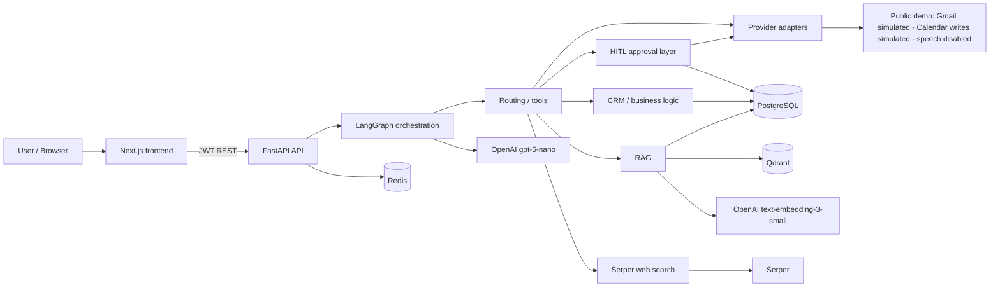

# Architecture Overview — OnePilot AI

Recruiter-facing map of the live public demo. Use this to scan GitHub in 30 seconds, or as a speaking outline in an interview.

**Live demo:** [https://one-pilot-ai.vercel.app](https://one-pilot-ai.vercel.app)  
**Deeper internals:** [architecture.md](../architecture.md) · [agent_workflow.md](../agent_workflow.md) · [rag_system.md](../rag_system.md)  
**Honest live-vs-simulated matrix:** [capabilities.md](../capabilities.md)

This page does not replace the [README](../../README.md). It explains how a request actually moves through the system.

---

## System at a glance

Read left to right: the browser never talks to models or providers directly. FastAPI owns auth and tenancy. LangGraph decides the path. Tools go through a registry. External writes stop at human approval. On the public demo, Gmail and Calendar adapters stay in mock mode.

| Layer | What it does |
|-------|----------------|
| Next.js | Landing, workspace, knowledge, leads, approvals, evaluation |
| FastAPI | Thin routers, JWT principal, validation, quotas |
| LangGraph | Two-stage routing, tool selection, structured response |
| Tools | RAG, CRM, email draft, calendar, Serper — never call providers directly |
| HITL | `ApprovalRequest` in Postgres before any external side effect |
| Adapters | OpenAI / Serper live; Gmail / Calendar mock on the public track |
| Data | Postgres (tenant rows), Redis (rate limits), Qdrant (vectors) |

Public runtime model is **`gpt-5-nano`**. Repo local default is `gpt-4o-mini`. Those are different claims.

---

## Request lifecycle

1. Browser hits Next.js. **Try the demo** calls `POST /demo/start` and stores a short-lived JWT.
2. FastAPI middleware assigns a request ID, then resolves a `Principal` (`user_id`, `organization_id`, role, plan).
3. The router validates the body and hands off to a service. Routers do not own business logic.
4. Chat goes through safety checks, then the LangGraph graph: message class → intent → tools → synthesis.
5. The service writes usage and audit rows, then returns JSON. The workspace renders the answer, citations, and a sanitized execution trace.

If the request is blocked (injection, quota, missing auth), it never reaches tool execution.

---

## RAG lifecycle

1. Seeded NovaEdge documents (19) are chunked with section-aware boundaries and embedded with `text-embedding-3-small`.
2. Chunks live in Postgres. Vectors live in a tenant-scoped Qdrant collection (`documents_{organization_id}`), with `organization_id` also filtered on read.
3. A question is embedded, retrieved, and scored. Weak evidence (cosine below `0.30`) returns a safe hedge and **does not call the LLM**.
4. Strong evidence is passed to `gpt-5-nano` with the retrieved context. Citations stay as document title + section.
5. Internal KB citations and Serper URLs are never mixed at retrieval time. Hybrid answers keep the two evidence lanes separate.

---

## Agent / tool lifecycle

1. Stage 1 classifies the message (knowledge, workflow, conversational, out of scope).
2. Stage 2 selects an intent (`knowledge_search`, `email_drafting`, calendar variants, `workspace_insights`, and others).
3. The graph calls tools only through the registry: `rag.answer`, `lead.support` / workspace insights, `email.draft`, calendar tools, `external.web_search`.
4. CRM ranking uses `rank_leads()` — urgency, then pipeline status, then name. Seeded data makes **Sarah Chen / Brightline Analytics** the top open lead.
5. Email drafts resolve an org-scoped lead and must not invent customer facts. The draft is structured; Gmail is not called yet.
6. Calendar tools distinguish *list meetings* from *availability / slots* from *create event*. Only creation is gated.

---

## HITL lifecycle

1. Gated actions (`gmail_create_draft`, calendar create, CRM-style writes) create an `ApprovalRequest` with payload and risk.
2. The workspace shows an approval-gated banner. The item also appears on **Approvals**.
3. Owner / Admin approve or reject. Rejected work is not auto-retried.
4. After approval, the provider adapter runs. On the public demo that adapter is **mock** — no real Gmail message and no live Calendar write.
5. The decision and execution metadata are audited.

In-app draft text can be generated without approval. Provider execution cannot.

---

## Safety / tenant isolation

- Every tenant-scoped row carries `organization_id`. Repositories filter on it. `ensure_same_org()` returns 403 on cross-org access.
- Qdrant collections are per organization; payload filters are applied on search.
- JWT + RBAC (Owner / Admin / Member / Viewer). Approvals are Owner/Admin only.
- Prompt-injection patterns are blocked before the graph.
- Logs and recruiter traces strip secrets, tokens, prompts, and raw provider payloads.
- Shared public-demo agent memory is disabled and cleared on `/demo/start`. Reviewers share one seeded org; they should not treat that as private-tenant isolation.

This is implemented product safety, not a SOC2 / enterprise certification claim.

---

## Production infrastructure

| Piece | Public demo |
|-------|-------------|
| Frontend | Next.js on Vercel — [one-pilot-ai.vercel.app](https://one-pilot-ai.vercel.app) |
| API | FastAPI on Railway |
| Postgres + Redis | Railway |
| Qdrant | Configured live retrieval for the seeded corpus |
| CI | GitHub Actions: backend pytest, frontend typecheck/tests/build, `scripts/tests` |

Local Docker Compose can run the same stack with mock/fallback providers when keys are absent.

---

## Real vs simulated

Aligned with the current README and the live public demo.

| Real | Simulated / disabled |
|------|----------------------|
| `gpt-5-nano` chat | Gmail draft/send (mock; send disabled) |
| `text-embedding-3-small` | Calendar event writes (mock; create disabled) |
| Qdrant retrieval + citations | Public speech transcription |
| Serper web search | Shared-demo agent memory persist |
| CRM ranking, routing, HITL, traces | Stripe / HubSpot / Twilio adapters |
| Vercel + Railway hosting | Live Google OAuth on this public URL |

Calendar **reads** (this week’s meetings, open slots) still go through the mock calendar provider. The routing and approval path are real; the inbox and calendar writes are not.
