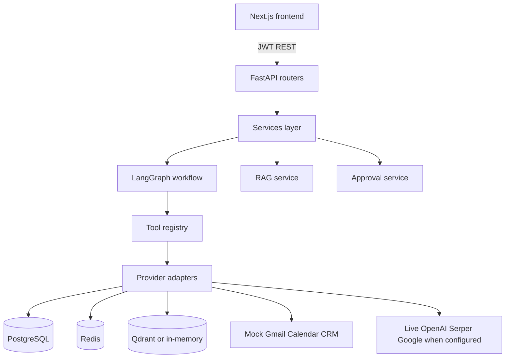

# Project Case Study — OnePilot AI

## Summary

**OnePilot AI** is a portfolio-grade, multi-tenant AI operations platform that helps small businesses answer questions from their own knowledge, run agentic workflows (email, calendar, leads), and keep a human in the loop before anything external executes.

**Live public demo:** https://one-pilot-ai.vercel.app  
**Backend:** https://onepilot-ai-production.up.railway.app  
**Source:** https://github.com/Fejjii/OnePilot-AI

## Problem

SMB operators work across docs, inbox, calendar, and CRM fragments. Off-the-shelf chatbots:

- Hallucinate without grounded company context
- Can take unsafe external actions if naively wired to APIs
- Lack tenant isolation, quotas, and auditability

## Solution

A single workspace that combines:

1. **RAG knowledge base** — upload documents, retrieve with citations, refuse weak evidence
2. **LangGraph agent** — two-stage intent routing, tool registry, multi-step workflows
3. **HITL approvals** — gated Gmail/Calendar/CRM-style actions with audit trail
4. **SaaS foundations** — orgs, RBAC, usage/quotas, provider diagnostics, evaluation harness

## Architecture (high level)

Details: [../architecture.md](../architecture.md)

## What’s real on the public demo

| Real | Simulated / mocked |
|------|--------------------|
| Landing + Try the demo | Gmail provider |
| Chat + intent routing | Google Calendar provider |
| Seeded KB search/answer | Stripe billing |
| Approvals queue + audit | HubSpot / Twilio |
| Leads, usage, evaluation UI | Agent memory on shared-demo tenant (disabled) |

## Safety story

- No autonomous external side effects
- Prompt-injection detection before agent execution
- Tenant-scoped repositories and vector collections
- Shared-demo memory isolation (disable agent memory + clear on demo start)
- Production startup validation for public-demo mock modes

## Engineering highlights

- Provider adapter pattern (mock / fallback / live) with `/providers` diagnostics
- Deterministic offline evaluation for routing, RAG golden set, and safety/HITL
- CI on `main` and `deployment/**` (backend pytest + frontend typecheck/test/build)
- Mobile-first workspace without abandoning desktop multi-panel layout
- Agent memory recall/persist with secret rejection (private tenants)

## Limitations (call these out)

- Not full production SaaS (no HTTP-only cookies, no streaming, no K8s)
- Public demo uses mock Gmail/Calendar by design
- JWT in `localStorage`
- In-memory vectors when Qdrant is unset

Full list: [../limitations_roadmap.md](../limitations_roadmap.md)

## Outcome

Recruiters can open a live URL, enter without credentials, and exercise the core product story in minutes: grounded answers, guided agent workflows, approvals, and honest provider transparency.
