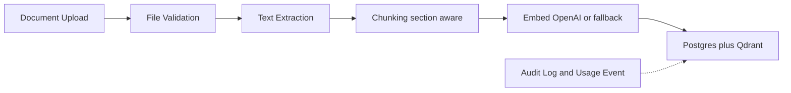
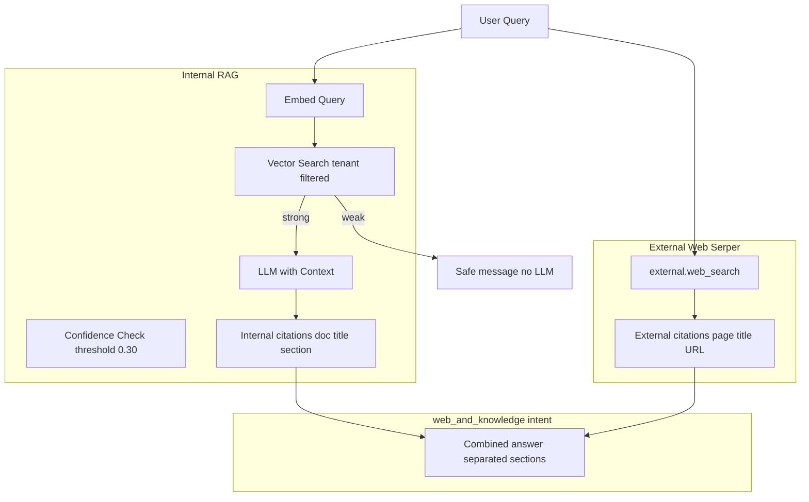

# RAG System

> **Status:** Implemented in Phase 4.

## Overview
The Retrieval-Augmented Generation (RAG) system powers the knowledge base. It ingests
documents, chunks them with section awareness, stores embeddings in a tenant-scoped
vector index, and produces grounded answers with explicit citations. When the retrieval
evidence is weak, the agent **does not guess** — it returns a configurable safe message
and asks the user to escalate to a human.

## Ingestion Pipeline

## Query and Hybrid Retrieval

Internal RAG and external Serper search are **never merged at retrieval time**. Hybrid questions run both tools and synthesize with separated citations.

**Demo hybrid prompt:** `Find recent SMB automation trends and compare them with NovaEdge Solutions services.`

## Supported File Types
| Format     | Extension | Extraction                                  |
|------------|-----------|---------------------------------------------|
| Markdown   | `.md`     | Built-in loader, headings preserved          |
| Plain Text | `.txt`    | Built-in loader                              |
| CSV        | `.csv`    | Built-in loader; rows serialized to `key: value` pairs |
| PDF        | `.pdf`    | Optional, via `pypdf` (graceful failure if missing) |
| Word       | `.docx`   | Optional, via `python-docx` (graceful failure if missing) |

All uploads pass through `security.file_validation.validate_file` for extension,
MIME-type, and size checks (default cap 50 MB).

## Chunking Strategy
- **Section-aware:** Markdown headings (`#`, `##`, `###`) become the `section` of every
  downstream chunk.
- **Default chunk size:** 800 characters with a 100-character overlap.
- **Section transitions** force a new chunk boundary so retrieval does not blend topics.
- **Token count** is approximated as `len(content) // 4` for quota and usage accounting.
- Embedding input is `f"{section}\n\n{content}"` so a chunk is retrievable by either its
  heading or its body.

## Tenant Isolation
- Every chunk row carries `organization_id`.
- The vector collection name is `documents_{organization_id}` — one collection per tenant.
- Every vector payload duplicates `organization_id` and is filtered on read.
- The repositories enforce `organization_id` on every `get`, `list`, and `delete`.

## Providers
- **Embeddings:** `OpenAIEmbeddingsProvider` when `OPENAI_API_KEY` is set, otherwise
  `FallbackEmbeddingsProvider` (deterministic token-hash embeddings — adequate for tests
  and local demos, not for production traffic).
- **Vector store:** `QdrantVectorProvider` when `QDRANT_URL` is set, otherwise
  `MemoryVectorProvider` (singleton in-process index — fine for tests and local demos).
- **LLM:** `OpenAILLMProvider` when `OPENAI_API_KEY` is set, otherwise
  `FallbackLLMProvider` (returns a deterministic synthesized answer for demos).

Provider instances are memoized at module scope via `onepilot.providers` so the
in-memory vector store persists data across requests in the same process.
Call `reset_provider_cache()` in tests to drop the singletons between runs.

## API Surface
| Endpoint                           | Description                                            |
|------------------------------------|--------------------------------------------------------|
| `POST /documents/upload`           | Upload & ingest a document; returns chunk count.       |
| `GET /documents`                   | List documents in the caller's organization.           |
| `GET /documents/{id}`              | Fetch a single document, optionally with chunks.       |
| `DELETE /documents/{id}`           | Delete a document, its chunks, and vector entries.     |
| `POST /knowledge/search`           | Semantic search with citations and weak-evidence flag. |
| `POST /knowledge/answer`           | Grounded answer with citations.                         |
| `POST /demo/seed`                  | Idempotent ingestion of the 19 NovaEdge demo docs.     |

## Weak-Evidence Behavior
- Threshold: `0.30` cosine similarity (see `services.rag_service.WEAK_EVIDENCE_THRESHOLD`).
- When the top score is below the threshold, the answer endpoint returns the configured
  message (`services.rag_service.WEAK_EVIDENCE_ANSWER`) and a `weak_evidence=True` flag.
- The LLM is **not called** in weak-evidence mode. This avoids hallucination cost and
  latency and follows the policy described in
  `backend/src/onepilot/demo_data/novaedge_docs/ai_usage_policy.md`.

## Confidence and Fallback Flags
Every search and answer response includes:
- `weak_evidence: bool` — `True` if retrieval evidence is insufficient.
- `fallback_used: bool` — `True` if either the embedding or LLM provider was the
  in-process fallback (no third-party API key configured).
- `confidence: float` (answer only) — currently the top retrieval score.

## Logging and Audit
- `document.uploaded` and `document.deleted` produce `AuditLog` rows with the actor,
  chunk count, and document id.
- `knowledge.searched` and `knowledge.answered` produce `AuditLog` rows with the hit
  count, weak-evidence state, and model used.
- Every search increments the `rag_queries` quota and writes a `UsageEvent` with token
  approximation, provider class name, fallback flag, and latency.
- Every answer additionally records a `chat_messages` `UsageEvent` capturing the LLM's
  reported token usage.

## Testing
The test suite covers:
- Chunking (section preservation, size bounds, transitions, error inputs).
- Ingestion loaders (text, markdown, csv; graceful failure for missing pdf/docx).
- Document upload/list/get/delete + tenant isolation.
- Semantic search with citations, weak-evidence path, tenant scoping, top-k limits.
- Answer endpoint with confident path and weak-evidence path.
- Quota and usage event tracking for RAG calls.
- Audit log entries for uploads.
- Deterministic demo data generation and idempotent seeding.
