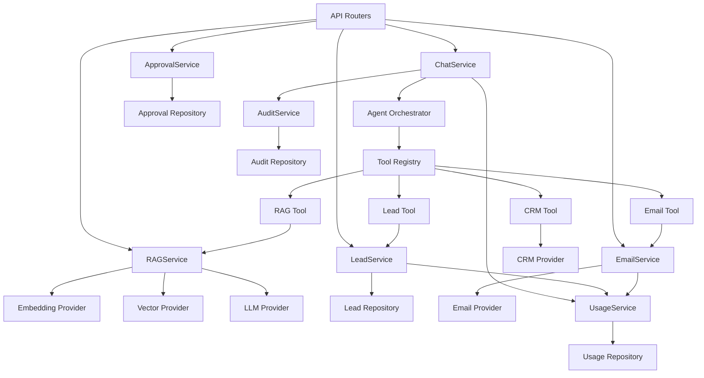

# Services and Scripts Documentation

This document describes the backend services, frontend modules, utility modules, and scripts that make up OnePilot AI.

---

## Backend Services

All services are located in `backend/src/onepilot/services/` and follow a consistent pattern:
- Accept dependencies via constructor (repositories, providers, settings)
- Enforce tenant isolation via `organization_id` checks
- Return typed Pydantic schemas
- Log audit events and usage metrics

### Core Services

#### 1. AuthService (`auth.py`)
**Purpose:** User authentication, JWT token management, password hashing

**Key Methods:**
- `authenticate_user(email, password)` — verify credentials, return JWT
- `register_user(email, password, full_name)` — create new user with bcrypt password
- `create_jwt(user_id, claims)` — generate signed JWT token
- `verify_jwt(token)` — decode and validate JWT
- `hash_password(password)` — bcrypt hash with salt
- `verify_password(plain, hashed)` — constant-time comparison

**Dependencies:**
- `UserRepository`
- `Settings` (JWT secret, algorithm, expiry)

---

#### 2. OrganizationService (`organization.py`)
**Purpose:** Tenant management, organization CRUD, member management

**Key Methods:**
- `create_organization(name, slug, creator_user_id)` — create new tenant
- `add_member(org_id, user_id, role)` — add user to organization with role
- `remove_member(org_id, user_id)` — remove user from organization
- `update_member_role(org_id, user_id, new_role)` — change user role
- `get_org_members(org_id)` — list all members with roles

**Dependencies:**
- `OrganizationRepository`
- `OrganizationMemberRepository`
- `AuditLogRepository` (logs all membership changes)

---

#### 3. PlanService (`plan.py`)
**Purpose:** Subscription plan management, plan limits, billing

**Key Methods:**
- `get_all_plans()` — list available plans (Free, Pro, Team, Business)
- `get_plan(plan_code)` — fetch plan details
- `subscribe(org_id, plan_code)` — create or update subscription
- `get_plan_limits(plan_code)` — return feature limits for plan
- `check_plan_feature(plan_code, feature, quantity)` — validate against limits

**Dependencies:**
- `PlanRepository`
- `SubscriptionRepository`

---

#### 4. QuotaService (`quota.py`)
**Purpose:** Usage tracking, quota enforcement, soft/hard limits

**Key Methods:**
- `check_quota(org_id, feature)` — return available quota for feature
- `increment_usage(org_id, feature, amount)` — increment usage counter
- `reset_quota(org_id, feature)` — reset usage to zero (for new period)
- `get_usage_summary(org_id)` — return usage across all features

**Dependencies:**
- `UsageQuotaRepository`
- `SubscriptionRepository`
- `PlanService`

**Tracked Features:**
- `chat_messages`
- `rag_queries`
- `document_uploads`
- `storage_mb`
- `email_drafts`
- `lead_workflows`
- `tool_calls`

---

#### 5. ChatService (`chat.py`)
**Purpose:** Conversation management, AI agent orchestration, message persistence

**Key Methods:**
- `create_conversation(org_id, user_id, title)` — create new chat session
- `send_message(org_id, user_id, conversation_id, content)` — process user message through agent
- `get_conversation_history(org_id, conversation_id)` — fetch all messages
- `list_conversations(org_id, user_id)` — list user's conversations

**Dependencies:**
- `ConversationRepository`
- `MessageRepository`
- `AgentOrchestrator` (LangGraph agent)
- `UsageEventRepository`
- `AuditLogRepository`

---

#### 6. RAGService (`rag.py`)
**Purpose:** Retrieval-augmented generation, semantic search, citation extraction

**Key Methods:**
- `search(org_id, query, top_k)` — semantic search over knowledge base
- `generate_answer(org_id, query, context)` — LLM-powered answer with citations
- `ingest_document(org_id, doc_id)` — chunk, embed, and index a document

**Dependencies:**
- `DocumentRepository`
- `DocumentChunkRepository`
- `EmbeddingProvider` (OpenAI or fallback)
- `VectorProvider` (Qdrant or in-memory)
- `LLMProvider` (OpenAI or fallback)

---

#### 7. LeadService (`lead.py`)
**Purpose:** Lead management, qualification scoring, CRM integration

**Key Methods:**
- `create_lead(org_id, email, name, source)` — create new lead
- `update_lead(org_id, lead_id, updates)` — update lead status/score
- `qualify_lead(org_id, lead_id)` — auto-qualify based on criteria
- `list_leads(org_id, filters)` — list leads with status filters

**Dependencies:**
- `LeadRepository`
- `CRMProvider` (HubSpot mock or real)
- `ApprovalService` (for status changes requiring approval)

---

#### 8. EmailService (`email.py`)
**Purpose:** Email drafting, approval workflow, send via provider

**Key Methods:**
- `draft_email(org_id, to, subject, context)` — generate email draft via LLM
- `send_email(org_id, draft_id)` — send approved draft via email provider
- `list_drafts(org_id)` — list all drafts

**Dependencies:**
- `EmailDraftRepository`
- `EmailProvider` (Gmail mock or real)
- `ApprovalService`
- `LLMProvider`

---

#### 9. ApprovalService (`approval.py`)
**Purpose:** Human-in-the-loop approval workflow

**Key Methods:**
- `create_request(org_id, user_id, action_type, payload, reason)` — create approval request
- `approve_request(org_id, request_id, reviewer_id)` — mark approved and execute
- `reject_request(org_id, request_id, reviewer_id, reason)` — mark rejected
- `list_pending(org_id)` — list all pending requests

**Dependencies:**
- `ApprovalRequestRepository`
- `AuditLogRepository`

---

#### 10. UsageService (`usage.py`)
**Purpose:** Usage event logging, cost estimation, analytics

**Key Methods:**
- `log_event(org_id, user_id, feature, model, tokens, metadata)` — create usage event
- `get_usage_events(org_id, filters)` — fetch events with filters
- `calculate_cost(input_tokens, output_tokens, model)` — estimate cost

**Dependencies:**
- `UsageEventRepository`

---

#### 11. MemoryService (`memory.py`)
**Purpose:** Conversation memory, long-term fact storage

**Key Methods:**
- `store_memory(org_id, conversation_id, fact)` — persist learned fact
- `retrieve_memory(org_id, conversation_id)` — fetch conversation context
- `search_long_term_memory(org_id, query)` — semantic search over facts

**Dependencies:**
- `MemoryItemRepository`
- `EmbeddingProvider`

---

#### 12. AuditService (`audit.py`)
**Purpose:** Audit log management, compliance tracking

**Key Methods:**
- `log_action(org_id, user_id, action, resource_type, resource_id, detail)` — create audit log
- `get_audit_logs(org_id, filters)` — fetch logs with filters

**Dependencies:**
- `AuditLogRepository`

---

## Backend Modules

### 1. Agents (`agents/`)
**Purpose:** LangGraph agent orchestration

**Key Files:**
- `orchestrator.py` — main agent entry point
- `graph.py` — LangGraph state graph definition
- `nodes.py` — graph node implementations (classify, route, execute, synthesize)
- `state.py` — `AgentState` TypedDict

---

### 2. Tools (`tools/`)
**Purpose:** Agent tool implementations

**Key Files:**
- `registry.py` — tool registration and lookup
- `rag_tool.py` — semantic search tool
- `lead_tool.py` — lead lookup/update tools
- `email_tool.py` — email draft/send tools
- `calendar_tool.py` — calendar check/book tools
- `crm_tool.py` — CRM update tools
- `web_search_tool.py` — web search tool

---

### 3. Providers (`providers/`)
**Purpose:** External system adapters (LLM, embeddings, vector, CRM, email, etc.)

**Key Files:**
- `llm/` — LLM provider (OpenAI, fallback)
- `embeddings/` — embedding provider (OpenAI, fallback)
- `vector/` — vector store (Qdrant, in-memory)
- `crm/` — CRM integration (HubSpot mock)
- `email/` — email provider (Gmail mock)
- `calendar/` — calendar provider (Google Calendar mock)
- `search/` — web search (Serper mock)
- `billing/` — billing provider (Stripe mock)

**Pattern:** Every provider has:
- `base.py` — abstract interface
- `openai_provider.py` / `qdrant_provider.py` — real implementation
- `fallback_provider.py` / `mock_provider.py` — deterministic fallback

---

### 4. Repositories (`repositories/`)
**Purpose:** Database access layer

**Key Files:**
- `base.py` — `BaseRepository` with tenant filtering
- `user.py`, `organization.py`, `plan.py`, `subscription.py`
- `document.py`, `document_chunk.py`
- `conversation.py`, `message.py`
- `lead.py`, `approval.py`, `usage_event.py`, `audit_log.py`

---

### 5. Security (`security/`)
**Purpose:** Auth, RBAC, guardrails

**Key Files:**
- `auth.py` — JWT utilities, password hashing
- `rbac.py` — role-based access control
- `guardrails.py` — prompt injection detection, sensitive data redaction

---

### 6. RAG (`rag/`)
**Purpose:** Document ingestion, chunking, retrieval

**Key Files:**
- `ingestion.py` — document parsing and chunking
- `retrieval.py` — vector search and ranking
- `synthesis.py` — answer generation with citations

---

### 7. Observability (`observability/`)
**Purpose:** Logging, tracing, metrics

**Key Files:**
- `logging.py` — structured logging setup
- `tracing.py` — LangSmith integration

---

### 8. Demo Data (`demo_data/`)
**Purpose:** Seed data for demos and tests

**Key Files:**
- `generators.py` — deterministic data generators
- `novaedge_docs/` — 19 markdown documents for NovaEdge Solutions

---

### 9. Evaluation (`evaluation/`)
**Purpose:** AI evaluation harness

**Key Files:**
- `runner.py` — evaluation orchestrator
- `intent_eval.py` — intent classification evaluation
- `datasets/` — test datasets

---

## Frontend Modules

All modules are located in `frontend/src/`.

### 1. App Router (`app/`)
**Purpose:** Next.js App Router pages

**Key Files:**
- `page.tsx` — Dashboard
- `workspace/page.tsx` — AI Workspace (chat)
- `knowledge/page.tsx` — Knowledge Base
- `leads/page.tsx` — Leads management
- `approvals/page.tsx` — Approval queue
- `memory/page.tsx` — Memory viewer
- `usage/page.tsx` — Usage dashboard
- `settings/page.tsx` — Organization settings
- `login/page.tsx`, `register/page.tsx` — Auth pages

---

### 2. Components (`components/`)
**Purpose:** Reusable React components

**Key Directories:**
- `ui/` — shadcn/ui primitives (Button, Input, Card, etc.)
- `layout/` — Layout components (Sidebar, Header)
- `chat/` — Chat UI (MessageList, MessageInput, CitationCard)
- `knowledge/` — Knowledge UI (DocumentUpload, DocumentCard)
- `leads/` — Lead UI (LeadTable, LeadCard)
- `approvals/` — Approval UI (ApprovalCard, ApprovalActions)

---

### 3. Lib (`lib/`)
**Purpose:** Utilities, API client, hooks

**Key Files:**
- `api.ts` — API client with auth headers
- `utils.ts` — utility functions
- `auth.ts` — auth context and hooks

---

### 4. Types (`types/`)
**Purpose:** TypeScript type definitions

**Key Files:**
- `index.ts` — core types (Organization, User, Document, Lead, etc.)

---

## Utility Scripts

All scripts are located in `backend/scripts/`.

### 1. `seed_demo.py`
**Purpose:** Seed the demo organization and NovaEdge documents

**Usage:**
```bash
python scripts/seed_demo.py
python scripts/seed_demo.py --url http://backend:8000   # inside Docker
```

**What it does:**
1. Calls `POST /demo/setup` to upsert demo org + user
2. Calls `POST /demo/seed` to ingest all 19 NovaEdge docs
3. Calls `GET /documents` to verify seeding success

---

### 2. `check_stack.py`
**Purpose:** Verify that all services (backend, Postgres, Redis, Qdrant) are reachable

**Usage:**
```bash
python scripts/check_stack.py
python scripts/check_stack.py --backend-url http://localhost:8000
```

**What it does:**
1. Checks backend health endpoint
2. Checks Postgres connection
3. Checks Redis connection (optional)
4. Checks Qdrant health endpoint (optional)
5. Returns exit code 0 if all required services pass, 1 otherwise

---

### 3. `dev_setup.py`
**Purpose:** First-time dev environment setup

**Usage:**
```bash
python scripts/dev_setup.py
```

**What it does:**
1. Runs Alembic migrations
2. Seeds demo data
3. Prints next steps

---

## Service Interconnections



---

## Notes

- All services enforce **tenant isolation** via `organization_id` checks
- All service methods are **synchronous** (no async/await) for simplicity
- All services return **typed Pydantic schemas**, not raw SQLAlchemy models
- All external actions log to **AuditLog** and **UsageEvent**
- All providers support **fallback/mock** implementations for resilience
