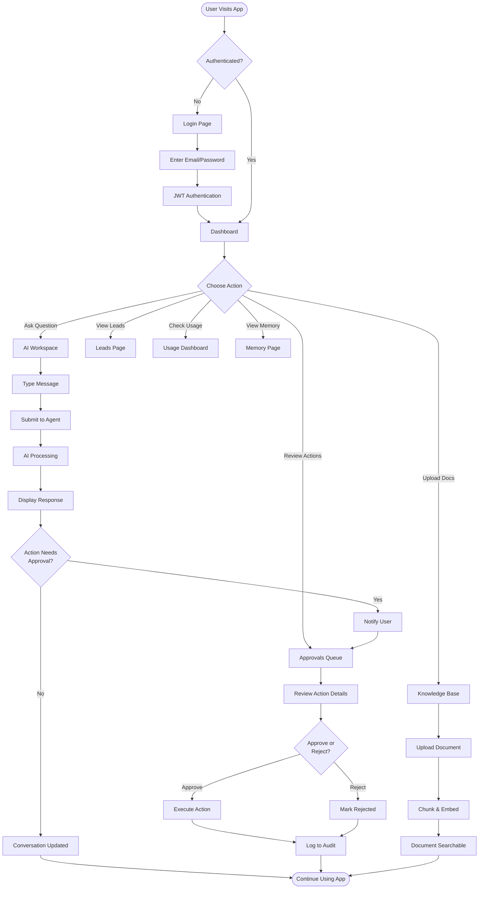
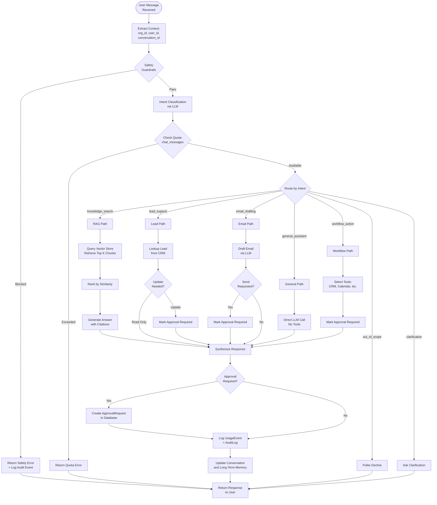
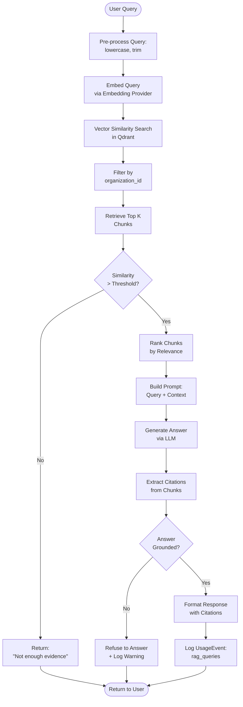
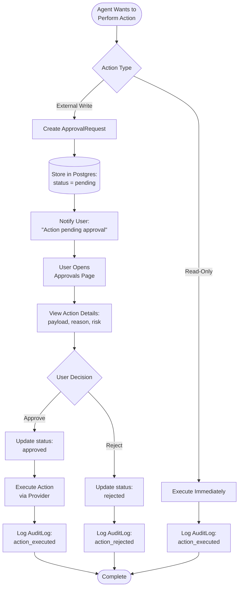
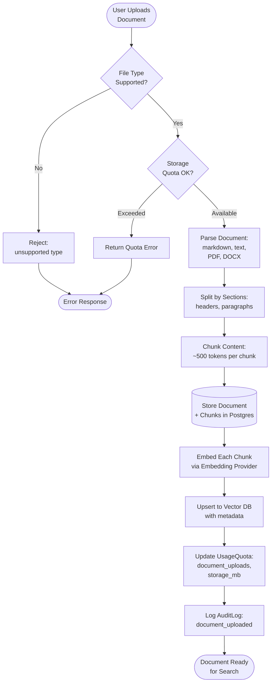

# Workflow Documentation

This document describes the end-to-end workflows in OnePilot AI, from user interaction to AI processing and external action execution.

---

## User Journey

---

## AI Workflow

---

## RAG Workflow

---

## Agent Workflow

The agent workflow follows LangGraph's node-based orchestration. See [agent_workflow.md](agent_workflow.md) for detailed implementation.

### High-Level Agent Flow

1. **Safety Check** — prompt injection detection, sensitive data scanning
2. **Intent Classification** — route to appropriate handler
3. **Quota Check** — enforce plan limits
4. **Tool Selection** — agent picks relevant tools based on intent
5. **Tool Execution** — call RAG, CRM, email, calendar, etc.
6. **Approval Gate** — create approval request if external action is needed
7. **Response Synthesis** — generate user-facing response
8. **Memory Update** — persist conversation and learned facts
9. **Usage Logging** — record tokens, cost, latency

---

## Human Approval Workflow

---

## Document Ingestion Workflow

---

## Notes

- All workflows enforce **tenant isolation** — every query includes `organization_id`
- All external actions log to **AuditLog** with actor, timestamp, and payload
- All LLM/embedding calls log to **UsageEvent** with token counts and cost estimates
- All approval requests create a database record before execution
- Fallback providers activate automatically when real API keys are missing
